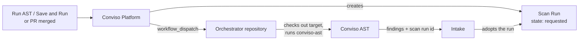
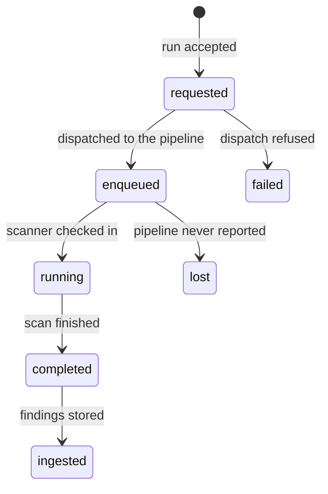
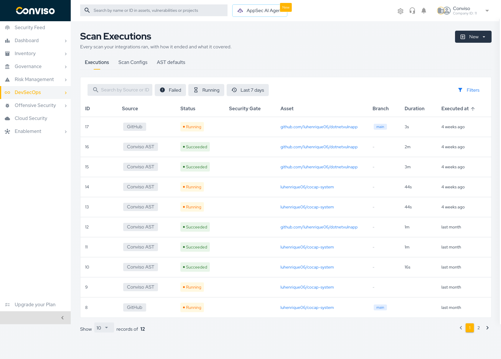

# Running Scans

A scan configuration decides *how* a scan runs. This page covers *when* it runs, and what happens between pressing a button and seeing findings.

## Two families of execution

| Family | Started by | Typical use |
| :--- | :--- | :--- |
| **Manual** | A person, from the Platform UI | Validating a configuration change, re-scanning after a fix, on-demand review |
| **Automated** | Your pipeline, the AST Orchestrator, or a schedule | Every push, every merged pull request, recurring DAST |

Both use the **same configuration**. There is no separate "manual configuration" — a manual run and a pipeline run of the same asset resolve identical settings.

## Manual execution

### Save and Run

On an AST configuration form, **Save and Run** persists the configuration and immediately starts a scan with it.

The order matters: the configuration is written **first**, and the scan only starts if that write succeeded. A failed save leaves you on the form with the error and starts nothing — you never get a scan running against settings that were not stored.

After the scan is accepted you are taken to:

- the **scan detail page**, if the run already has an execution to show; or
- the **Executions list**, with a *Scan queued* message, when the scan has not checked in yet.

### Run scan

Opening a saved configuration exposes **Run scan** in the header. Same flow, without the save step.

### Run AST from the asset

Repository assets also carry a **Run AST** button next to *Edit* and *Archive* in the asset header. It runs the AST configuration that already applies to that asset, resolving the branch automatically.

The button is disabled when the asset cannot be scanned, and the tooltip names the reason — see [Why a run is refused](#why-a-run-is-refused).

:::note
**Save and Run** and **Run AST** are the same underlying flow. The only differences: Save and Run persists the configuration first, and it passes the branch you selected on the form explicitly, while Run AST resolves the branch on its own.
:::

## Automated execution

### The AST Orchestrator

The AST Orchestrator is how the Platform runs AST **on your own infrastructure**. Your application repositories need no Conviso workflow — one orchestrator repository holds the workflow, and the Platform dispatches it with the target repository and branch.

The Platform can only **trigger** the pipeline — it cannot watch it. That shapes the whole design:

1. A **Scan Run** is created in `requested` **before** the dispatch.
2. Its id travels with the dispatch as an input.
3. When the scanner checks in, the intake **adopts** that id, correlating the pipeline execution with the run the UI is already showing.
4. If the pipeline never reports back, a reaper closes the run out instead of leaving it in flight forever.

Supported providers, each with its own setup guide:

- **[GitHub AST Orchestrator](../../integrations/github-ast-orchestrator.md)**
- **[GitLab AST Orchestrator](../../integrations/gitlab-ast-orchestrator.md)**
- **[Azure DevOps AST Orchestrator](../../integrations/azure-devops-ast-orchestrator.md)**
- **[Bitbucket AST Orchestrator](../../integrations/bitbucket-ast-orchestrator.md)**

The dispatch carries the target repository, the branch, your Platform URL, the company and asset ids, and the scan run id.

### Direct CI/CD

You can also call the Conviso AST CLI straight from your own pipeline, without an orchestrator. The scan still resolves its configuration from the Platform, so the Scan Config screens remain the single source of truth. See **[Scan Application with Conviso](../conviso-ast/conviso-ast.md)**.

### Pull request scanning

Pull request scans run on merge events rather than on demand. See **[Pull Request Scanning](../pull-requests/pull-requests.md)**.

### Scheduled DAST

A DAST configuration with scheduling enabled runs on its own interval, weekday, and time. Its trigger reads **Scheduled** in the Scan Configs list. No pipeline involvement — the Platform starts it.

## Branch resolution

When a run does not name a branch explicitly, the Platform resolves one in this order:

1. The branch configured for AST on the asset.
2. The orchestrator reference configured on the integration.
3. The asset's default branch.

Everything downstream is per branch — the scan run, the execution history, and the findings. A branch execution profile is what makes a specific branch scan differently.

## The scan run lifecycle

| State | Meaning |
| :--- | :--- |
| **requested** | The run exists; the pipeline has not been dispatched yet |
| **enqueued** | The pipeline was dispatched successfully |
| **running** | The scanner reported that it started |
| **completed** | The scan finished |
| **ingested** | Findings were stored and are visible in Vulnerability Management |
| **failed** | The dispatch could not happen — a setup problem, not a transient one |
| **lost** | The pipeline never reported back within the expected window |

You watch this in the **Executions** tab.

The list shows the source, status, security gate result, asset, branch, duration, and when the scan ran. Filters narrow it to failures, running scans, or a time window.

## One scan at a time per branch

The Platform allows **one in-flight AST run per branch**. Triggering a second while the first is still `requested`, `enqueued`, or `running` is refused with:

> *An AST scan is already running for this branch. Wait for it to finish.*

This is enforced against the runs themselves, not a timer, so the message is always true. Double-clicking **Run AST** produces one scan, not two.

A run stuck in `enqueued` past the request window does not block the branch forever — a new trigger supersedes it and the abandoned run is marked `lost`.

## Why a run is refused

When a scan cannot start, the Platform explains why instead of failing silently. The message appears in the UI, and on the **Run AST** button it appears as a tooltip.

| Message | Fix |
| :--- | :--- |
| *Only repository assets can be scanned by the AST* | AST needs a repository asset. Associate the repository first |
| *Asset is archived* | Unarchive the asset |
| *This asset is not linked to a GitHub, GitLab, Azure DevOps or Bitbucket integration* | Connect the integration and associate the repository |
| *AST scans are disabled for this integration* | Re-enable AST scans in the integration settings |
| *The AST orchestrator is not configured for this integration* | Fill in the orchestrator repository, workflow, and ref — see the provider guides above |
| *This asset has no branch to scan* | Import at least one branch for the asset |
| *That branch is not imported for a GitHub, GitLab, Azure DevOps or Bitbucket integration* | The branch you selected is not imported. Import it or pick another |
| *The branch configured for the AST was never imported for this asset* | The configured AST branch does not exist on the asset. Fix the configuration or import the branch |
| *An AST scan is already running for this branch* | Wait for the current scan to finish |

:::tip
The most common refusal on a first run is **the orchestrator is not configured**. It is checked *before* any Scan Run is created, so a misconfigured integration produces a clean message rather than a stuck run.
:::

## Related

- **[Creating Scan Configs](./creating-scan-configs.md)** — Save and Run in context
- **[Scan Configs Overview](./scan-configs.md)** — trigger kinds and the configuration model
- **[Security Gate](../security-gate.md)** — gating a pipeline on scan results
