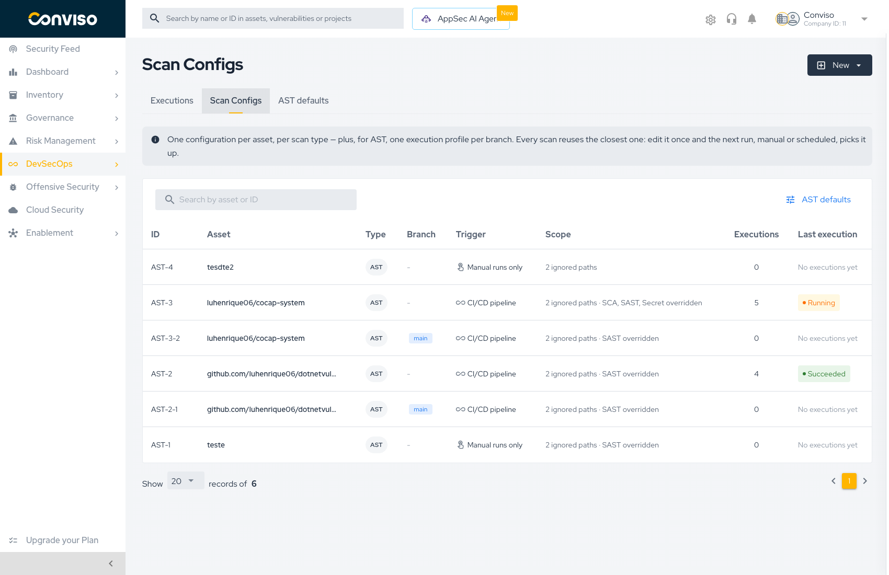
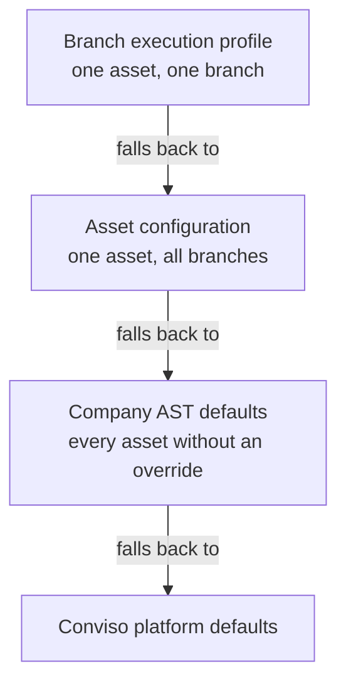

# Scan Configs

**Scan Configs** is where you define *how* a scan runs, separately from *when* it runs and *what it found*. One configuration is stored per asset and per scan type, and every execution — manual, scheduled, or triggered by your pipeline — reuses the closest matching configuration.

Edit a configuration once, and the next run picks it up. You never have to re-declare scanner options inside your CI/CD files.

## The Scans context

Everything lives under **DevSecOps → AST** in the side menu, which opens a context with three tabs:

| Tab | What it holds |
| :--- | :--- |
| **Executions** | Every scan that already ran, with status, duration, asset, and branch |
| **Scan Configs** | The saved configurations — one row per asset/type, plus one row per AST branch profile |
| **AST defaults** | The company-wide AST baseline that every asset inherits from |

## The configuration model

Three levels resolve from most specific to most general. A scan always uses the closest one that exists:

- **Company AST defaults** — the baseline for the whole company. Managed in the **AST defaults** tab.
- **Asset configuration** — overrides the defaults for one asset. Applies to every branch that has no profile of its own.
- **Branch execution profile** — overrides the asset configuration for one specific branch. A release branch and a feature branch rarely need the same scan.

Inheritance is **per module**, not all-or-nothing. An asset can override SAST while still inheriting SCA, IaC, Container, SBOM, and Secret from the company defaults.

:::note
Overriding is a deliberate act. Creating a configuration does not copy the defaults into it — the modules you do not touch stay linked to the defaults, so a later change to the company baseline still reaches them.
:::

## Reading the list

Each row is one configuration.

| Column | Meaning |
| :--- | :--- |
| **ID** | Stable identifier. `AST-3` is the asset configuration; `AST-3-2` is a branch profile derived from it |
| **Asset** | The asset the configuration is attached to |
| **Type** | `AST` or `DAST` |
| **Branch** | The branch for a branch profile; `-` when the configuration covers every branch |
| **Trigger** | How this configuration gets executed — see below |
| **Scope** | What narrows the scan: ignored paths, plus which modules are overridden |
| **Executions** | How many scans have used this configuration |
| **Last execution** | Status of the most recent run, or *No executions yet* |

### Trigger kinds

| Trigger | Meaning |
| :--- | :--- |
| **CI/CD pipeline** | Your pipeline (or the AST Orchestrator) starts the scan |
| **Scheduled** | The Platform starts the scan on a recurring schedule — DAST only |
| **Manual runs only** | The scan runs when someone presses **Run scan** or **Save and Run** |

The trigger is **derived**, not chosen from a dropdown. It reflects how the asset is actually wired: an asset connected to a repository integration with an orchestrator reads as *CI/CD pipeline*; a DAST configuration with scheduling enabled reads as *Scheduled*; anything else reads as *Manual runs only*.

## What each scan type configures

**AST** covers six modules, each configured independently:

| Module | Analyzes |
| :--- | :--- |
| **SAST** | Your own source code |
| **SCA** | Third-party dependencies |
| **IaC** | Infrastructure-as-code misconfigurations |
| **Container** | OS-level vulnerabilities in container images |
| **SBOM** | Software Bill of Materials generation |
| **Secret** | Credentials and secrets committed to the repository |

**DAST** configures a single dynamic analysis against a running application or API: scan profile, analysis type, scope, authentication, and schedule.

## Access requirements

| Requirement | Applies to |
| :--- | :--- |
| `AST_SCAN_ACCESS` plan permission | The whole AST experience, including the **AST defaults** tab |
| Company **Admin** profile | Creating, editing, and deleting AST configurations and rules |
| Asset visibility | Starting a scan from an asset you can already see |

Reading and editing AST configuration requires an Admin profile in that company. Starting a scan on an asset you can already see does not.

## Where AST is documented

AST spans three concerns, and each has its own home in these docs. Start from the one that matches what you are doing:

| You want to | Read |
| :--- | :--- |
| Configure what a scan does, in the Platform | **This section** — Scan Configs |
| Understand the scanner itself, or run it from a terminal | **[Conviso AST (CLI)](../conviso-ast/conviso-ast.md)**, under *Scanners* |
| Wire your repository provider so the Platform can trigger scans | The **AST Orchestrator** guide for your provider, under *Integrations → Source Code Management*: **[GitHub](../../integrations/github-ast-orchestrator.md)** · **[GitLab](../../integrations/gitlab-ast-orchestrator.md)** · **[Azure DevOps](../../integrations/azure-devops-ast-orchestrator.md)** · **[Bitbucket](../../integrations/bitbucket-ast-orchestrator.md)** |

The orchestrator guides live with their provider integration because they are provider setup, not scan configuration — you follow one of them once, then never again.

## Where to go next

- **[Creating Scan Configs](./creating-scan-configs.md)** — build an AST or DAST configuration from scratch
- **[AST Defaults](./ast-defaults.md)** — set the company-wide baseline
- **[AST Rules](./ast-rules.md)** — enable, disable, and create SAST rules
- **[Running Scans](./running-scans.md)** — manual and automated execution flows
