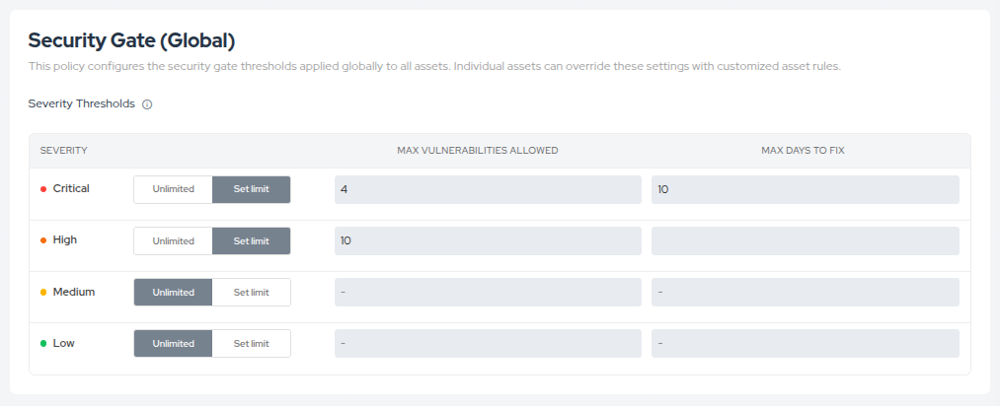
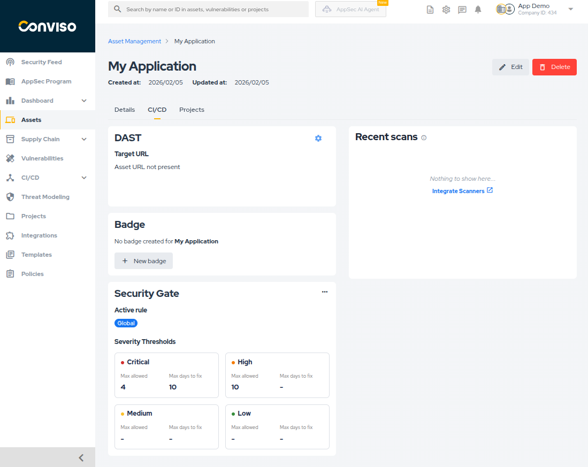
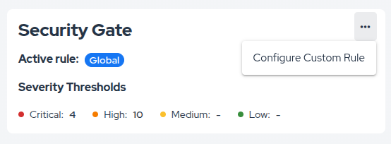
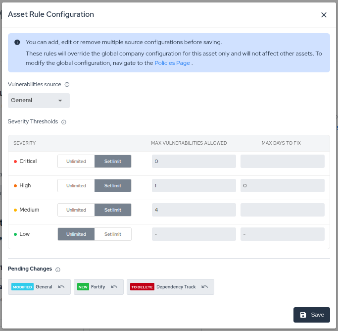
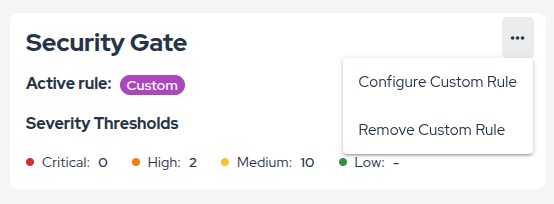
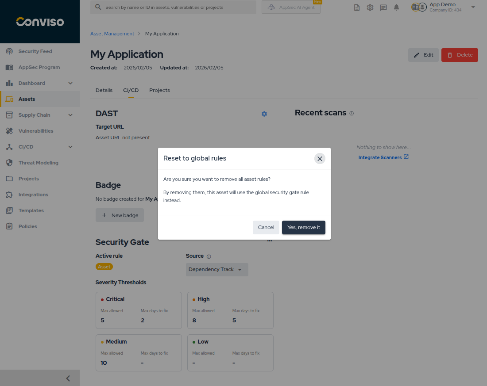

## Overview

**Security Gate** is the control that lets you define vulnerability thresholds and use them to evaluate whether a build should proceed in CI/CD.

The feature combines two layers:

* **Platform configuration and monitoring**: define the rules, review executions, and inspect why a pipeline passed, failed, or generated a warning.
* **AST enforcement in CI/CD**: run the assertion command during the pipeline so the configured policy is enforced automatically.

This guide covers both parts.

## Prerequisites

Before using Security Gate with Conviso AST, set your API key:

```bash
export CONVISO_API_KEY='your-api-key'
```

## How Security Gate Works

At a high level, the flow is:

1. Define the policy that will be used for an asset.
2. Run the Security Gate assertion in CI/CD.
3. Review the execution result in the Platform when needed.

Security Gate evaluates vulnerabilities that are still considered open risks, especially those in `Identified`, `In Progress`, and `Awaiting Validation`.

For status definitions, see [Workflow Status](/vulnerability-management/workflow-status).

## Configuring Security Gate in the Platform

The Platform is the recommended place to manage Security Gate because policies take effect immediately and remain centralized.

There are two main configuration models:

* **Global rule**: default rule applied to all assets.
* **Asset rule**: override for a specific asset.

### Global Rule Configuration

Use the global rule to define the default company-wide baseline.

1. Navigate to **Policies**.
2. Locate the **Security Gate (Global)** section.
3. Configure each severity level with:
   * **Max Vulnerabilities Allowed**
   * **Max Days to Fix**
4. Click **Save Policies**.

<div style={{textAlign: 'center'}}>



</div>

Practical interpretation:

* if the number of vulnerabilities stays within the allowed threshold, the rule can pass;
* if the count exceeds the threshold but none are overdue, the result may become `Warning`;
* if vulnerabilities exceed the allowed aging window, the result becomes `Failed`.

### Asset Rules

Use an asset rule when a specific asset needs different thresholds from the global baseline.

Common cases:

* legacy applications that need a gradual hardening path;
* critical assets that require stricter limits;
* special projects with different operational constraints.

To review the active rule for an asset:

1. Navigate to **Assets**.
2. Open the target asset.
3. Go to the **CI/CD** tab.
4. Review the **Security Gate** card.

<div style={{textAlign: 'center'}}>



</div>

To create or edit an asset rule:

1. Open the Security Gate card options menu.
2. Select **Add/Edit configuration**.
3. Define the desired thresholds.
4. Review the pending changes.
5. Save the configuration.

<div style={{textAlign: 'center'}}>



</div>

<div style={{textAlign: 'center'}}>



</div>

To remove the override and return to the global rule:

1. Open the Security Gate card options menu.
2. Select the reset option.
3. Confirm the removal.

<div style={{textAlign: 'center'}}>



</div>

<div style={{textAlign: 'center'}}>



</div>

## Monitoring Security Gate in the Web Interface

The Platform is also the main place to inspect Security Gate executions after the pipeline runs.

### Execution List

Go to **CI/CD > Security Gate** to see the execution list across the company.

<div style={{textAlign: 'center'}}>


</div>

From this screen, you can:

* filter by status, asset, and execution date;
* search by execution ID or asset name;
* sort the list by ID, status, or execution time;
* save a default filter view.

### Execution Statuses

Each execution is displayed with one of these statuses:

* **Passed**: the evaluated vulnerabilities are within the configured thresholds.
* **Warning**: the configured quantity threshold was exceeded, but there are no overdue vulnerabilities according to `Max Days to Fix`.
* **Failed**: at least one vulnerability exceeded the configured aging rule or another threshold that blocks the pipeline.

### Execution Details

Click any execution to inspect the result in detail.

<div style={{textAlign: 'center'}}>


</div>

This view helps you confirm:

* which asset and execution time were evaluated;
* which rule type was applied:
  * `Global`
  * `Asset`
  * `Custom`
* what threshold was expected for each severity;
* how many vulnerabilities were found;
* how many were already expired based on the configured aging window;
* which recent scans provide context for the result.

## Running Security Gate in CI/CD with AST

After the policy is defined, execute Security Gate in the pipeline with Conviso AST.

### Using Platform-based Configuration

If the policy is managed in the Platform, use:

```bash
conviso vulnerability assert-security-rules
```

This command fetches the active Security Gate rule for the asset and evaluates the vulnerabilities against it.

### Using YAML-based Configuration

If you prefer to keep the rule in the repository, use:

```bash
conviso vulnerability assert-security-rules --rules-file 'FILE_NAME.yml'
```

This makes the pipeline evaluate the YAML rule directly from the repository instead of the Platform configuration.

## Understanding CLI Results

After running the assertion command, the pipeline receives a success or failure result.

### Success Response

If the rule is respected, the output is similar to:

```text
Starting vulnerabilities security rules assertion
✅ Vulnerabilities security rules assertion finished
```

### Failure Response

If the rule is violated, the output is similar to:

```text
Starting vulnerabilities security rules assertion
💬 Vulnerabilities summary
[
    {
        "from": "any",
        "severity": {
            "high": {
                "quantity": 7
            }
        }
    }
]
Error: Vulnerabilities quantity offending security rules
```

In practice, this means the evaluated vulnerabilities exceeded the configured threshold and the pipeline should be treated as blocked.

## Creating Security Gate Rules in YAML

Use YAML configuration when you want the policy to live in the repository as code.

:::tip
If you prefer centralized administration, use the Platform configuration instead and keep YAML out of the repository.
:::

### Basic Example

The structure is based on one or more rules:

```yml
rules:
- from: any
  severity:
    critical:
      maximum: 0
    high:
      maximum: 5
    medium:
      maximum: 0
    low:
      maximum: 0
```

This example blocks the pipeline if the evaluated asset has more than `5` high vulnerabilities from any source.

If you want to validate only selected severities, omit the ones you do not want to enforce:

```yml
rules:
- from: any
  severity:
    critical:
      maximum: 0
    high:
      maximum: 5
```

### Vulnerability Aging

You can also enforce how long vulnerabilities may remain open before they start blocking the pipeline:

```yml
rules:
- from: any
  severity:
    critical:
      maximum: 0
    high:
      maximum: 0
      max_days_to_fix: 10
    medium:
      maximum: 1
      max_days_to_fix: 30
    low:
      maximum: 5
      max_days_to_fix: 90
```

Interpretation:

* `critical` blocks immediately if at least one matching vulnerability exists;
* `high` blocks when a high vulnerability remains open for more than `10` days;
* `medium` allows one open finding, but blocks when there are more than that and they exceed `30` days;
* `low` allows up to five open findings before the configured aging condition becomes blocking.

## Recommended Approach

For most teams, the most practical model is:

1. manage the rule in the Platform;
2. use asset overrides only when justified;
3. run `conviso vulnerability assert-security-rules` in CI/CD;
4. investigate results in the web interface when a pipeline warns or fails.

Use YAML rules when policy-as-code inside the repository is a stronger requirement than centralized administration.

## Support

If you have any questions or need help using Conviso AST, please don't hesitate to contact our [support team](mailto:support@convisoappsec.com).
