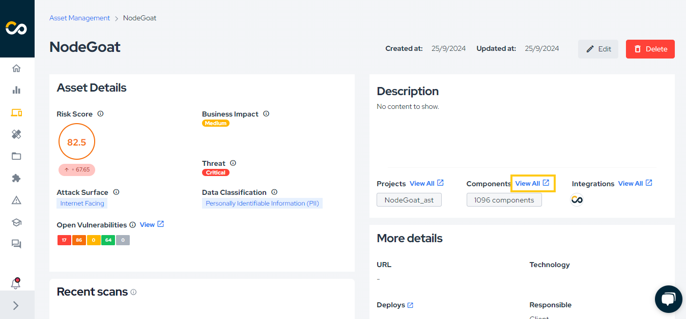

## Introduction

Today, it is almost impossible to develop software without using third-party libraries. Many solutions have already been designed and transformed into libraries that we can use and adapt in our software. However, this reliance on external libraries poses risks to our applications, as these third-party components may contain vulnerabilities and/or have licenses that conflict with our own applications.

A Software Bill of Materials (SBOM) helps us build an inventory of our components, providing us with the necessary visibility into what components are included in our software. By utilizing an SBOM, organizations can:

1. **Identify Vulnerabilities**: Organizations can easy see what components has vulnerabilities, quantity and cves related.

2. **Ensure Compliance**: Helps ensure compliance with licensing requirements and can help avoid legal complications.

3. **Streamline Audits**: Simplifies the audit process by providing a clear and comprehensive list of software components.

4. **Enhance Supply Chain Security**: Organizations can better assess the security of their software supply chain and take action against potential risks.

5. **Facilitate Incident Response**: Provides critical information to identify affected components quickly, allowing for a more efficient response.

This is crucial for enhancing software transparency, security, and compliance. By providing visibility into the existence of vulnerabilities for each component, an SBOM aids in decision-making and prioritization.

You can always learn more in our blog:
- [Software bill of materials what it is and how it works](https://blog.convisoappsec.com/en/software-bill-of-materials-sbom-what-it-is-and-how-it-works/) to learn more about SBOM.
- [The importance of supply chain to application security](https://blog.convisoappsec.com/en/the-importance-of-supply-chain-to-application-security/) to learn more about Supply Chain.

## SBOM Formats Overview

SBOMs (Software Bill of Materials) describe the components, dependencies, and metadata of software. Below are the key formats:

- **CycloneDX**: Lightweight format for application security and risk management. Supports XML and JSON formats. 
- **SPDX**: Focuses on license compliance and component tracking. Supports multiple formats like JSON, YAML, and RDF/XML.
- **SWID**: An ISO-standardized format primarily used for identifying and managing software assets installed on systems. Leverages XML for data structuring and interchange.

### Common SBOM Elements:
- **Component Name**: The name of the software or library.
- **Version**: The version number of the component.
- **License**: Licensing information.
- **Checksum**: Hash values for integrity verification.
- **Supplier**: Entity providing the software.
- **Dependency Relationships**: How components depend on each other.

## Sub-dependencies and License Detection in SBOM Generation
When generating a Software Bill of Materials (SBOM), it's crucial to track both direct and sub-dependencies (transitive dependencies). The tools used in SBOM generation, such as the one we employ, aim to provide a comprehensive list of software components. However, the ability to detect sub-dependencies varies across different ecosystems and package managers. In some cases, sub-dependencies may not always be fully captured, depending on how the tool integrates with the specific technology stack.

In addition to dependency tracking, detecting licenses is a critical aspect of SBOM generation. Our tool supports the detection of various licenses, helping ensure compliance with open-source and proprietary software requirements. However, complete license detection is not always possible, particularly for packages that lack clear metadata or license information. Despite these limitations, our approach provides significant visibility into both dependencies and their licenses, helping to manage legal and security risks.

## Use of Syft
To achieve this level of detail in our SBOM generation, we use Syft, a powerful tool that scans container images and filesystems for dependencies and licenses.

## How to generate and view components in Conviso Platform

An SBOM file will be generated and sent to the respective asset each time you run `conviso ast run` or `conviso sca run`.

After running our AST, you can simply access the asset and you will find a Components section, just click on `View All`:

<div style={{textAlign: 'center'}}>



</div>

Once you enter the page, you'll see all the components of this asset, including the component name, version, technology, license (if available), package manager, CVEs, and open vulnerabilities. You can filter by component name, as shown in the first reference in the image, and you can also display only components with vulnerabilities, as indicated in the second reference in the image.

<div style={{textAlign: 'center'}}>


</div>

If a component has vulnerabilities, you can click on the severity to be redirected to the associated vulnerability or vulnerabilities, as shown in the image below.


## Via API

If you don't use Conviso AST, you can import an SBOM in CycloneDX format using our GraphQL API:

The base URL for Conviso API GraphQL endpoints is `https://app.convisoappsec.com/graphql`.

You need to pass the SBOM file in CycloneDX format, asset id and company id to be able to import an SBOM file.

The request body looks like this:

```json
{
  "operations": {
    "query": "mutation ImportSbom($file: Upload!) { importSbom(input: { file: $file, assetId: ID!, companyId: ID! }) { success } }",
    "variables": {
      "file": [null]
    }
  },
  "map": {
    "0": ["variables.file"]
  },
  "0": "sbom_file.json"
}
```

This request will return a boolean value inside the success field, indicating whether the request was successful or not, like this:

```json
{
	"data": {
		"importSbom": {
			"success": true
		}
	}
}
```

## Support

Should you have any questions or require assistance while using the Conviso SBOM feature at any stage of the process, feel free to contact our dedicated support team.

[](https://cta-service-cms2.hubspot.com/web-interactives/public/v1/track/redirect?encryptedPayload=AVxigLKtcWzoFbzpyImNNQsXC9S54LjJuklwM39zNd7hvSoR%2FVTX%2FXjNdqdcIIDaZwGiNwYii5hXwRR06puch8xINMyL3EXxTMuSG8Le9if9juV3u%2F%2BX%2FCKsCZN1tLpW39gGnNpiLedq%2BrrfmYxgh8G%2BTcRBEWaKasQ%3D&webInteractiveContentId=125788977029&portalId=5613826)