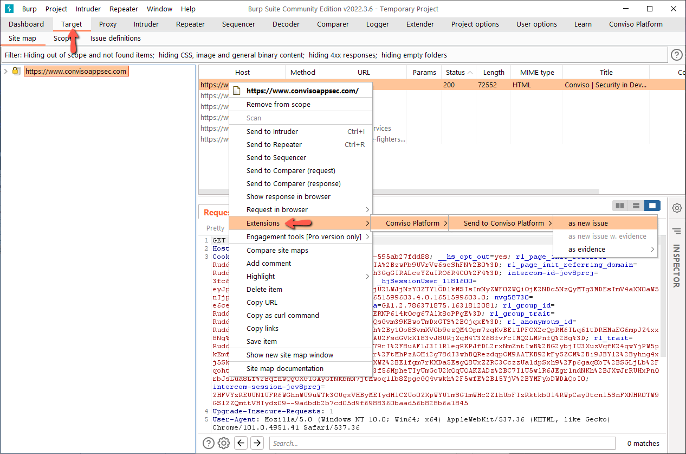
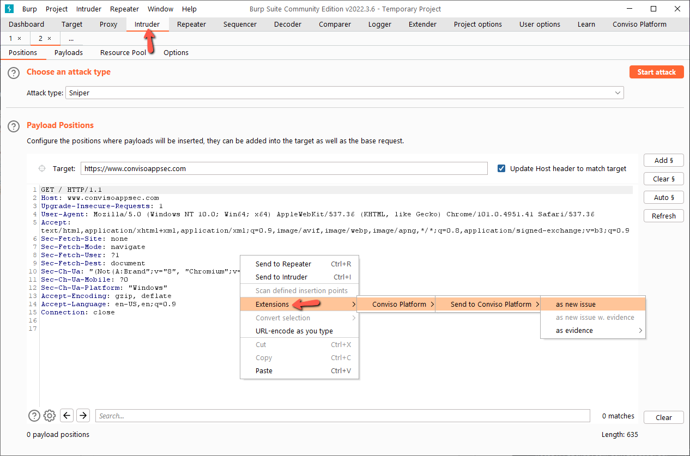
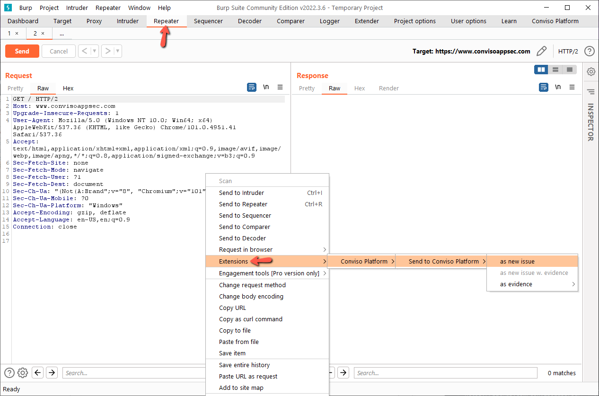

The Burp extension adds items to the Burp's context menu, that is, regardless of where you are in the Burp application, you can send a REQUEST / RESPONSE to the extension and fill in the fields automatically. To send a request to the extension, just right click on the request/response and select an option in the **Conviso Platform > Send to Conviso Platform submenu**.

Here are the categories that can are supported with auto fill of camps:
* [as new issue](./as-new-issue)
* [as new issue with evidence](./as-new-issue-with-evidence)
* [as evidence](./as-evidence)

### Target tab

### Proxy tab

### Intruder tab

### Repeater tab

