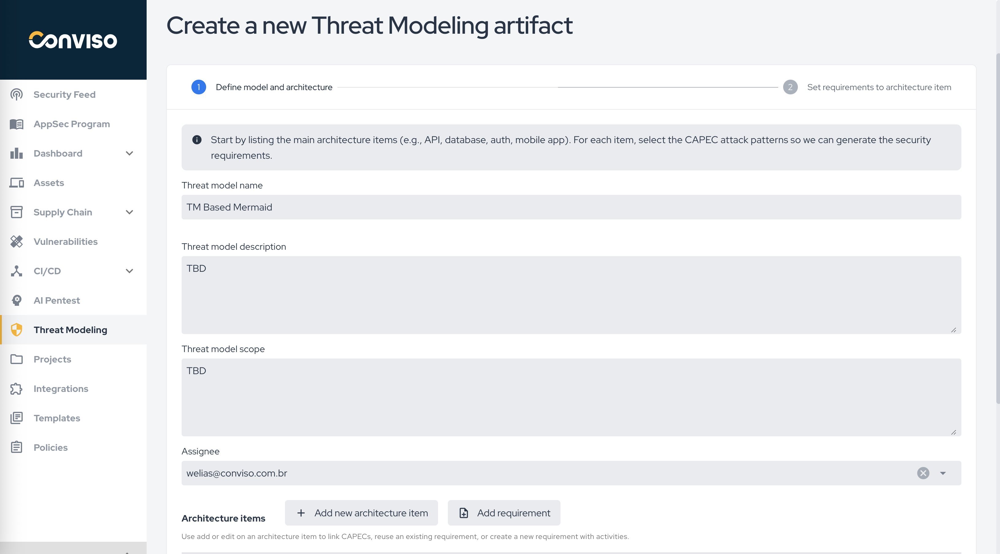
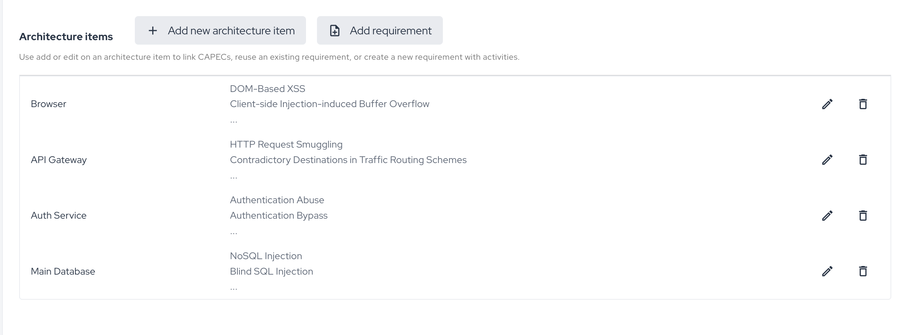

## Overview

The **Create a new Threat Modeling artifact** flow is used to define the model, register the system architecture, and connect architecture items to attack patterns and requirements.

The flow is organized in two major steps:

1. **Define model and architecture**
2. **Set requirements to architecture item**

## Define Model and Architecture

In the first step, fill in the main model fields:

* **Threat model name**
* **Threat model description**
* **Threat model scope**
* **Assignee**

These fields define the artifact context and the responsible user before the detailed architecture is modeled.

## Architecture Items

Architecture items represent the main parts of the system that will be evaluated in the threat model.

Examples include:

* browser;
* API gateway;
* authentication service;
* main database;
* mobile app;
* internal services.

The platform guidance on the screen indicates that, for each architecture item, CAPEC attack patterns should be selected so the corresponding security requirements can be generated.

## Available Actions in the Architecture Section

Inside the architecture section, you can:

* **Add new architecture item**
* **Add requirement**
* edit an existing architecture item;
* remove an architecture item.

This section is the operational base of the model, because it connects the architecture structure to the generated requirements.

## Requirements in the Artifact Flow

The screen text indicates that the team can:

* link CAPECs to an architecture item;
* reuse an existing requirement;
* create a new requirement with activities.

This means the threat modeling artifact is not limited to identifying risks. It also becomes the source for generating or associating actionable requirements that can later be executed in project workflows.

## Recommended Use

Use this creation flow when:

* the architecture needs to be modeled with traceability;
* the team wants to connect architecture elements to attack patterns;
* the objective is to generate structured security requirements from the modeled architecture.
