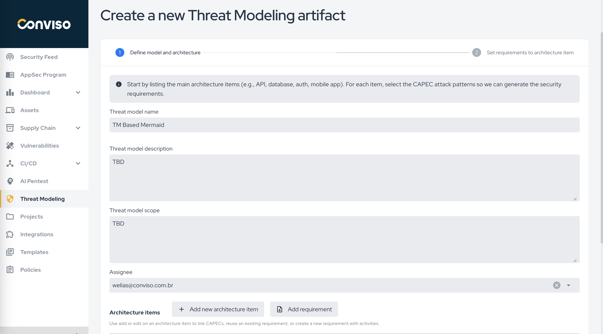
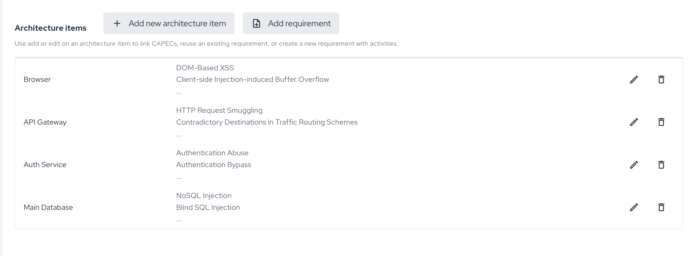

The manual flow gives you full control over the model. Choose it when you already know which components matter and want to decide yourself which attack patterns apply.

If you are starting from a diagram, the [AI-assisted flow](./create-threat-modeling.md) is faster, and you can refine the result afterwards.

## Objective

By the end of this guide, you will have:

- Defined a threat model with its name, description, scope, and owner.
- Registered the architecture items that make up the system.
- Connected those items to CAPEC attack patterns and security requirements.

## Prerequisites

- Access to the **Threat Modeling** module in the left-hand menu.
- A clear view of the system's components and how they interact.

## Steps

### Step 1 – Define the model

1. Click **Threat Modeling**, then **Create threat model**.
2. Select **Create manual threat model**.
3. Fill in the **Threat model name**, **Threat model description**, **Threat model scope**, and **Assignee**.

*Step 1: Manual creation flow, organized as define the model and then set requirements.*

### Step 2 – Add the architecture items

1. In the architecture section, click **Add new architecture item**.
2. Name the component — for example a browser, an API gateway, an authentication service, a database, or an external provider.
3. Repeat for every part of the system worth analyzing.
4. Edit or remove items as the model takes shape.

*Step 2: Architecture items registered for the model.*

:::tip
Keep items at the level you would actually assign work to. "Payment service" is useful; "the entire backend" is too broad to produce actionable requirements.
:::

### Step 3 – Connect items to attack patterns and requirements

1. Select an architecture item.
2. Link the **CAPEC** attack patterns that apply to it. CAPEC is a public catalogue of the ways systems get attacked, and it is how the platform knows which requirements to generate.
3. Reuse an existing requirement, or create a new one with its activities.
4. Repeat for each architecture item.

## Validation

| Check | Expected result |
|---|---|
| Model details | Name, description, scope, and assignee are saved. |
| Architecture section | Every component you added is listed. |
| Requirements | Each architecture item has the requirements you linked or created. |
| Artifact list | The model appears in **Threat Modeling** with a version and a last-updated date. |

## Troubleshooting

| Problem | What to do |
|---|---|
| No requirements were generated for an item | No CAPEC was linked to it. Open the item and select the applicable attack patterns. |
| You cannot decide which CAPECs apply | Start with the ones matching how the component is reached — for example authentication, input handling, or data storage. |
| The model is too coarse to act on | Split broad architecture items into smaller components and link CAPECs to each. |

## Next steps

The artifact behaves exactly like one generated by the AI flow — same versioning, same path into a project:

- [Read the Artifact and Its Versions](./threat-modeling-artefact.md)
- [Turn Requirements into a Project](./management-projects-with-requirements-based-in-tm.md)

## Support

Should you have any questions or require assistance while using the Conviso Platform, feel free to reach out to our dedicated support team.
