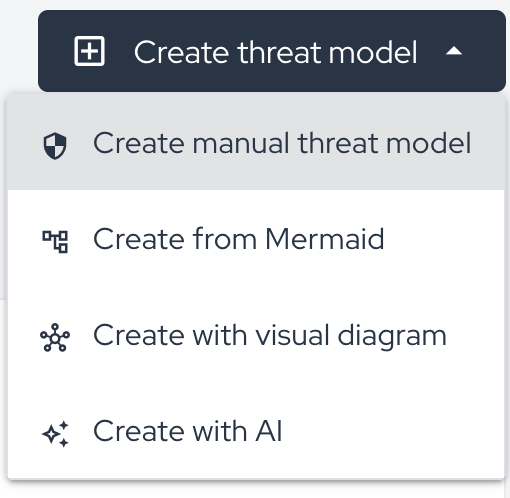
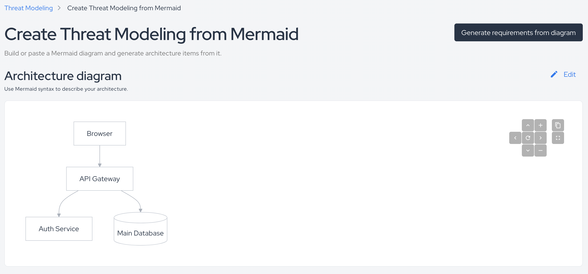
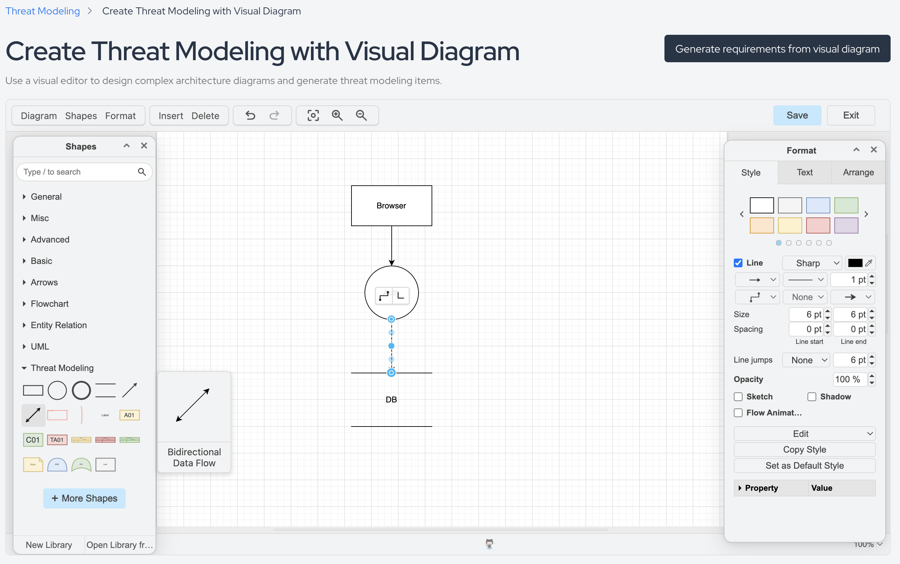
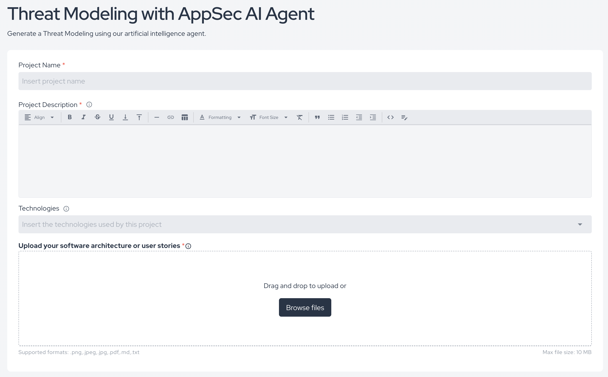

## Overview

The **Create threat model** menu lets you start a new threat modeling flow according to the information format your team already has available.

## Available Types

### Create Manual Threat Model

Use this option when the team wants to define the model directly in the platform, manually describing the architecture, threat scope, and related requirements.

This is useful when:

* the architecture is being modeled collaboratively;
* there is no diagram ready to import;
* the team wants full control over the structure from the beginning.

This flow is usually the best fit when the team already knows the components that should become architecture items and wants to build the model step by step in the platform.

### Create from Mermaid

Use this option when your system architecture already exists as a Mermaid diagram or when the team prefers to describe architecture in Mermaid syntax.

In this flow, the platform renders the Mermaid-based architecture diagram and provides an action to generate requirements from that diagram.

This is useful when:

* the team documents architecture in code;
* diagrams are already maintained in repositories or markdown files;
* you want to reuse an existing architectural representation as the basis for threat modeling.

Use this option when you want a diagram-as-code experience with traceability to the architecture definition.

### Create with Visual Diagram

Use this option when the threat model should be created directly from a visual editor inside the platform.

This screen provides a visual canvas where you can:

* build the architecture diagram manually;
* use shapes and threat-modeling elements;
* connect components with visual relationships;
* format the diagram and adjust the model before generating requirements.

This is useful when:

* architecture is documented visually instead of as text;
* stakeholders work better with diagram-based modeling;
* the existing documentation is already maintained in a design-oriented format.

Use this option when the architecture discussion is diagram-first and the team wants to model directly on the canvas.

### Create with AI

Use this option when you want the platform to generate the initial threat model from contextual inputs and an uploaded architecture or user-story file.

In this flow, the platform asks for:

* **Project Name**
* **Project Description**
* **Technologies**
* **Upload your software architecture or user stories**

Supported file formats shown on the screen are:

* `.png`
* `.jpeg`
* `.jpg`
* `.pdf`
* `.md`
* `.txt`

This is useful when:

* you want to accelerate the initial modeling step;
* the architecture is already represented in a diagram;
* you want assistance generating the initial threat modeling structure and requirements from the provided context.

## Choosing the Right Flow

As a practical rule:

* use **Manual** when the model will be built from scratch in the platform;
* use **Mermaid** when the architecture already exists as Mermaid or should be maintained as code;
* use **Visual Diagram** when the architecture should be modeled visually on a canvas;
* use **AI** when you want the platform to generate the starting point from a file plus contextual inputs.
