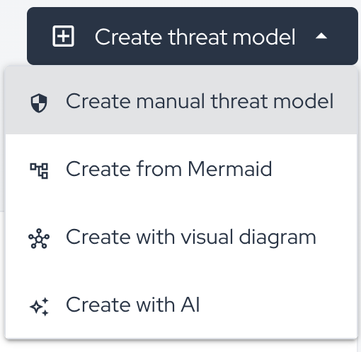
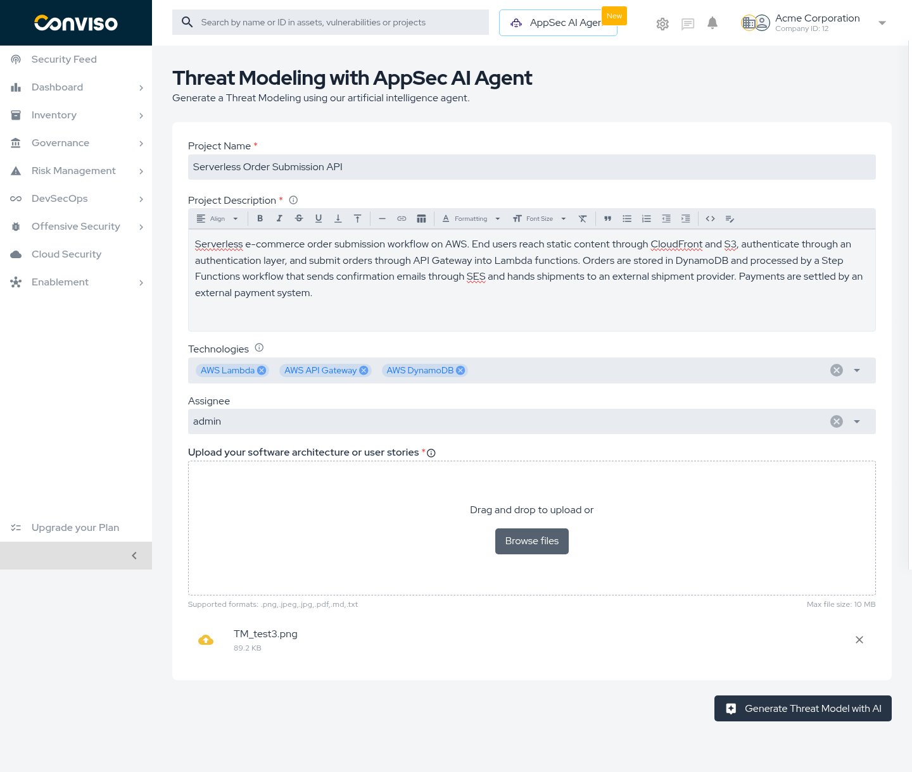
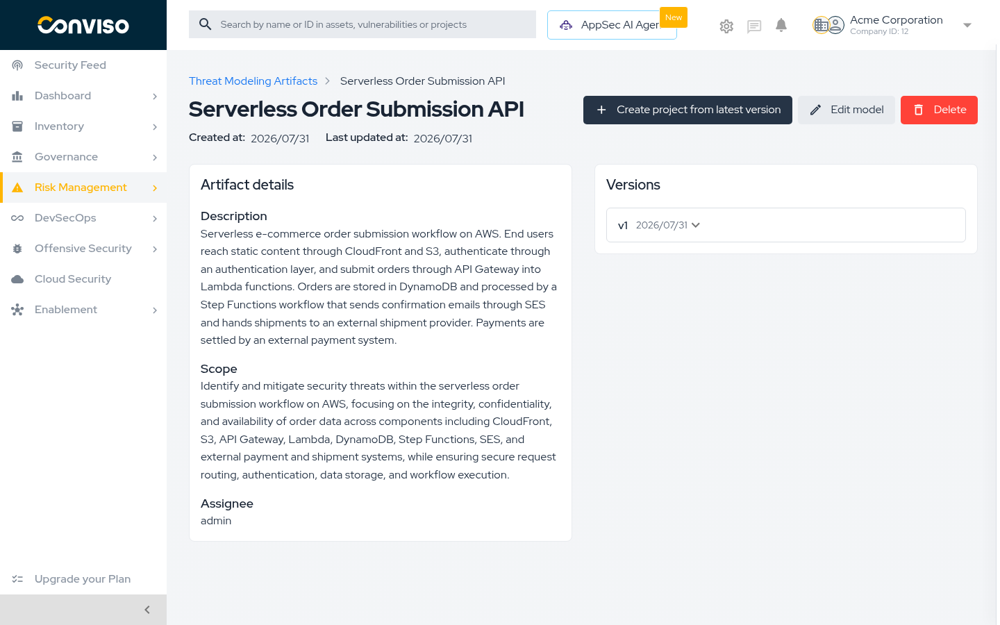
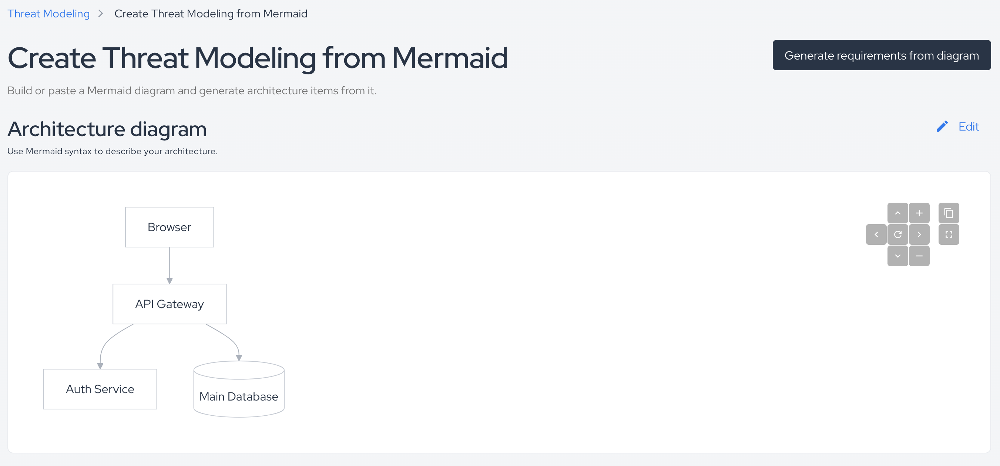
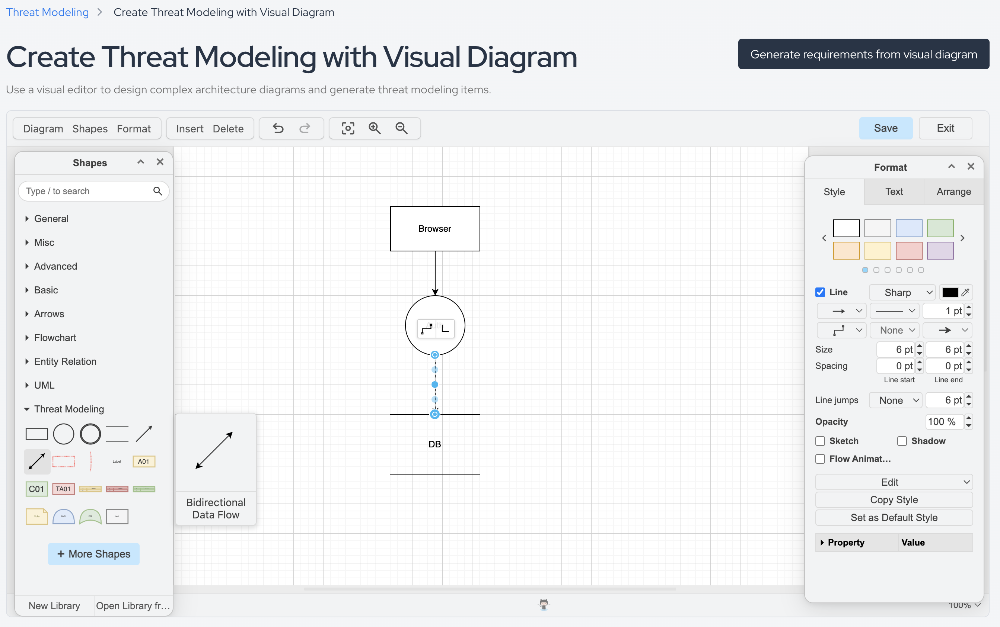

A threat model answers one question: what could go wrong with this system, and what should we do about it? In the Conviso Platform you describe your system once, and the platform turns that description into concrete security requirements your team can implement and track.

## Objective

By the end of this guide, you will have:

- Chosen the creation flow that fits how your architecture is documented.
- Generated a threat modeling artifact from an architecture diagram using the AppSec AI Agent.
- Reviewed the scope and requirements the agent produced.

## Prerequisites

- Access to the **Threat Modeling** module in the left-hand menu.
- A description of the system you want to analyze.
- An architecture diagram or a user story file, in `.png`, `.jpeg`, `.jpg`, `.pdf`, `.md`, or `.txt`, up to **10 MB**.
- For the AI flow: the **AppSec AI Agent** enabled for your company.

## Steps

### Step 1 – Choose a creation flow

1. In the left-hand menu, click **Threat Modeling**.
2. Click **Create threat model** in the upper right.
3. Select the option that matches how your architecture is documented.

*Step 1: Create threat model menu open, showing the available creation options.*

All options produce the same result — an artifact with security requirements. They differ only in how you describe the system.

| Option | Choose it when |
|---|---|
| **Create manual threat model** | You already know your components and want full control. See [Create a Threat Model Manually](./create-a-new-threat-modeling-artifact.md). |
| **Create from Mermaid** | Your architecture already exists as a Mermaid diagram. |
| **Create with visual diagram** | You prefer to draw the architecture on a canvas in the platform. |
| **Create with AI** | You have a diagram or a written description and want the platform to do the first pass. **This guide follows this option.** |

:::note
**Create with AI** requires the AppSec AI Agent to be enabled for your company. If the option is not in the menu, use one of the other three flows or contact our support team.
:::

### Step 2 – Describe your system

1. Select **Create with AI**.
2. Enter the **Project Name**. Use the name your team already uses for this system.
3. Write the **Project Description** in plain language: who uses the system, what data flows through it, and which external services it calls. The richer this text, the more useful the generated requirements.
4. Add **Technologies** as tags. Type each one and press <kbd>Enter</kbd>.
5. Select an **Assignee** to own the model.
6. Click **Browse files** and attach one architecture diagram or user story file.

*Step 2: AI form completed, with technologies added, an assignee selected, and the architecture diagram attached.*

The **Project Name**, **Project Description**, and the uploaded file are required. Supported formats and the 10 MB limit are shown below the upload area.

### Step 3 – Generate the artifact

1. Click **Generate Threat Model with AI**.
2. Keep the page open. Generation takes around one minute.
3. Wait until the platform redirects you to the new artifact.

*Step 3: Generated artifact showing the description, the scope written by the agent, the assignee, and version v1.*

## Validation

| Check | Expected result |
|---|---|
| Redirect after generating | You land on the artifact page, not on the form. |
| **Description** | Shows the text you submitted. |
| **Scope** | Describes the components and data flows the agent identified. If it misses part of your system, your description needs more detail. |
| **Versions** | Lists **v1** with today's date. |
| Artifact list | Your model appears in **Threat Modeling** with latest version `v1`. |

## Troubleshooting

| Problem | What to do |
|---|---|
| **Create with AI** is not in the menu | The AppSec AI Agent is not enabled for your company. Use another flow or contact support. |
| The file is rejected | Confirm it is under 10 MB and in a supported format. Attach a single file. |
| Error message after clicking Generate | The agent could not complete the analysis. Your form is preserved — click Generate again. If it persists, contact support. |
| The generated scope misses part of the system | Rewrite the description with more detail and generate a new version. See [Read the Artifact and Its Versions](./threat-modeling-artefact.md). |

## Other creation flows

### Create from Mermaid

Use this when your architecture is written as a Mermaid diagram or kept as diagrams-as-code in a repository.

*Create from Mermaid: the platform renders the diagram and generates requirements from it.*

### Create with visual diagram

Use this when you prefer to draw the architecture instead of writing it.

*Create with visual diagram: canvas for building the architecture inside the platform.*

## Next steps

- [Read the Artifact and Its Versions](./threat-modeling-artefact.md)
- [Turn Requirements into a Project](./management-projects-with-requirements-based-in-tm.md)

## Support

Should you have any questions or require assistance while using the Conviso Platform, feel free to reach out to our dedicated support team.
