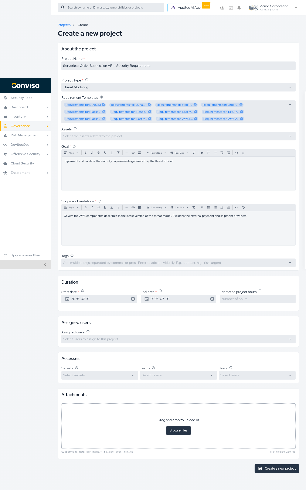
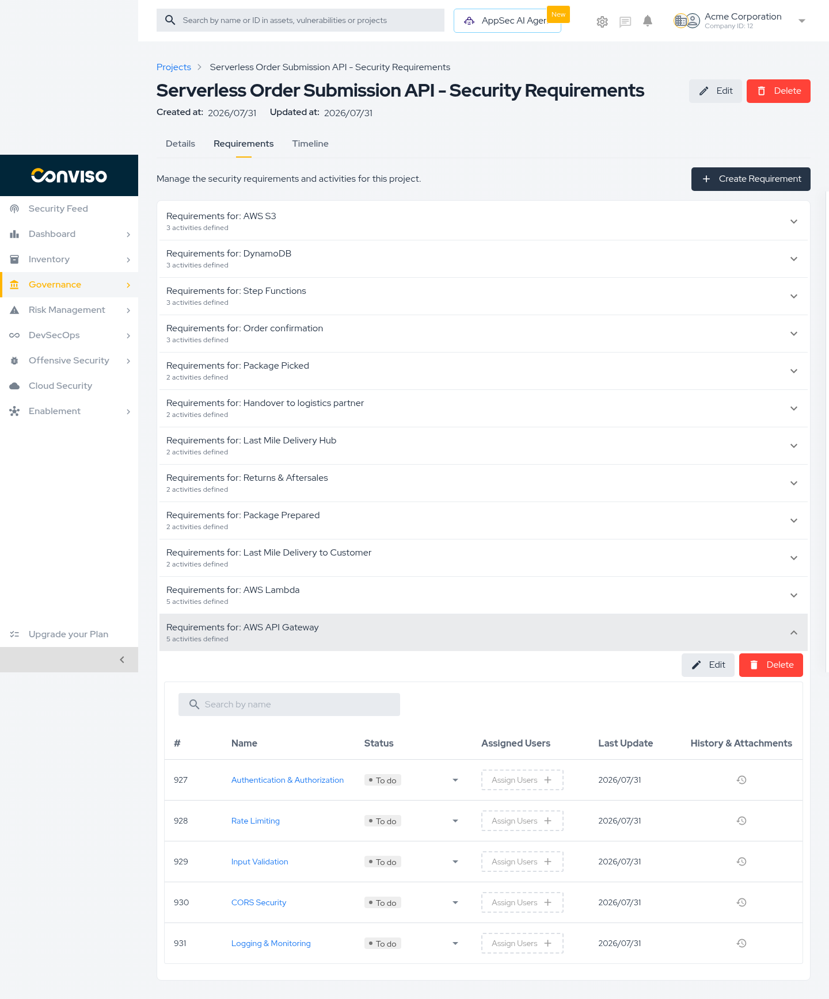

A threat model nobody acts on is a document. This guide turns it into work: the platform creates a project from the requirements generated for each part of your architecture, so your team can assign, track, and evidence each one.

## Objective

By the end of this guide, you will have:

- Created a project from the latest version of a threat model.
- Located the security requirements and activities generated for each architecture item.
- Understood how to move activities through their statuses and attach evidence.

## Prerequisites

- A threat modeling artifact with at least one version. See [Create a Threat Model](./create-threat-modeling.md).
- Permission to create projects in your company.

## Steps

### Step 1 – Create the project

1. Open the artifact in **Threat Modeling**.
2. Click **Create project from latest version**.
3. Enter the **Project Name**.
4. Select the **Start date** and **End date** from the calendar.
5. Fill in the **Goal** and the **Scope and limitations**.
6. Review **Requirement Templates** and remove any architecture item you do not want to work on now.
7. Click **Create a new project**.

*Step 1: Project form opened from the artifact, with Project Type set to Threat Modeling and one requirement template per architecture item.*

The platform pre-fills **Project Type** as **Threat Modeling** and lists one requirement template per architecture item found in the model.

| Field | Required |
|---|---|
| **Project Name** | Yes |
| **Start date** and **End date** | Yes |
| **Goal** | Yes |
| **Scope and limitations** | Yes |
| Assets, Tags, Assigned users, Teams, Attachments | No |

### Step 2 – Open the generated requirements

1. Open the project from **Projects**.
2. Select the **Requirements** tab.
3. Click a requirement group to expand it.

*Step 2: Requirements tab listing one group per architecture item, with a group expanded to show its activities.*

Each group corresponds to one part of your architecture and shows how many activities it contains. Expanding it reveals the activities, each with a name, status, assigned users, last update, and history with attachments.

### Step 3 – Work through the activities

For each activity:

1. Confirm whether it applies to your system.
2. Assign it to whoever will do the work.
3. Move it to **Running** when work starts.
4. When finished, move it to **Done** and attach the evidence.
5. If it does not apply, mark it **Not Applicable** and record the justification.

| Status | Use it when |
|---|---|
| **To do** | Not started. Every activity begins here. |
| **Running** | Work is in progress. |
| **Done** | Implemented, with evidence attached. |
| **Not Applicable** | Does not apply to your system. Always justify. |
| **Not According** | Reviewed and found not to meet the requirement. |

:::tip
Attach evidence while the work is fresh — a screenshot, a configuration excerpt, or a link to a pull request. It is what turns "we handled it" into something you can prove later.
:::

## Validation

| Check | Expected result |
|---|---|
| After creating the project | You are redirected to **Projects** and the new project is listed. |
| Project **Details** | **Project Type** is **Threat Modeling**. |
| **Requirements** tab | Shows one group per architecture item from the model. |
| Expanding a group | Lists its activities, each starting at **To do**. |

## Troubleshooting

| Problem | What to do |
|---|---|
| **This field is required** on submit | **Start date**, **End date**, **Goal**, and **Scope and limitations** are mandatory. Dates only accept values from the calendar. |
| The **Requirements** tab is empty | The version used had no requirement groups. Generate a new version and create the project again. |
| A requirement group is missing | It was removed from **Requirement Templates** during creation. Add it with **Create Requirement**, or create a new project from the artifact. |
| The requirements do not reflect the current architecture | The project was created from an older version. [Generate a new version](./threat-modeling-artefact.md) and create a project from it. |

## Next steps

- [Read the Artifact and Its Versions](./threat-modeling-artefact.md)
- [Project Management / Process](../project-management/process.md)
- [Project Management / Workflow Status](../project-management/workflow-status.md)
- [Requirements](../platform/requirements.md)

## Support

Should you have any questions or require assistance while using the Conviso Platform, feel free to reach out to our dedicated support team.
