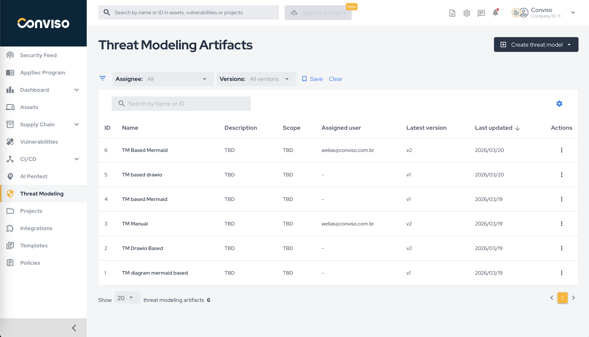

## Overview

The **Threat Modeling Artifacts** screen is the main list view for managing the threat models created in the platform.

From this screen, teams can:

* review all existing artifacts;
* filter by assignee and version;
* search by name or ID;
* identify the latest version of each model;
* open the actions menu for each artifact;
* start a new threat model.

## Access the Screen

To access this view, click **Threat Modeling** in the left-hand menu.

## Main Elements

The screen includes:

* **Create threat model**: entry point for creating a new model.
* **Filters**: currently available for assignee and versions.
* **Saved filters**: save and clear filter combinations.
* **Search bar**: search by artifact name or ID.
* **Artifact table**: lists ID, name, description, scope, assigned user, latest version, and last update.
* **Actions column**: access operations for each artifact.

## How to Use This View

Use this page when you need to:

* find a threat model already created;
* verify who is assigned to each artifact;
* identify whether a model has newer versions;
* continue a threat modeling effort that was already started;
* open the artifact details page for version history and requirement changes.

## Related Pages

After reviewing the list, the most common next steps are:

* [Create Threat Modeling](./create-threat-modeling.md)
* [Threat Modeling Artefact](./threat-modeling-artefact.md)
* [Create a New Threat Modeling Artifact](./create-a-new-threat-modeling-artifact.md)
