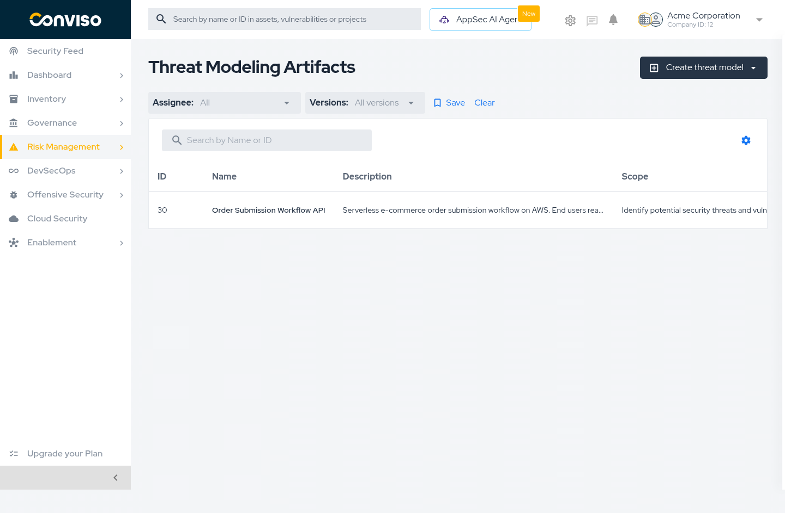

**Threat Modeling Artifacts** is the home of the module: every threat model your company has created lives here.

## Objective

By the end of this guide, you will have:

- Located a specific threat model using search and filters.
- Understood what each column of the list tells you.
- Opened an artifact to continue working on it.

## Prerequisites

- Access to the **Threat Modeling** module in the left-hand menu.

## Steps

### Step 1 – Open the artifact list

1. In the left-hand menu, click **Threat Modeling**.

*Step 1: Artifact list with search, filters, and the Create threat model button.*

Each row is one threat model:

| Column | What it means |
|---|---|
| **ID** | The artifact identifier. The copy icon puts it on your clipboard. |
| **Name** | The system being modeled. Click it to open the artifact. |
| **Description** | The system as it was described. |
| **Scope** | What the model covers. |
| **Assigned user** | Who owns it. |
| **Latest version** | `v1`, `v2`, and so on. |
| **Last updated** | When the most recent version was generated. |
| **Actions** | Per-artifact operations. |

### Step 2 – Find a specific model

1. Use **search** to filter by name or ID.
2. Use the **Assignee** filter to see only the models a given person owns.
3. Use the **Versions** filter to narrow the list.
4. Click **Save** to keep a filter combination, or **Clear** to reset it.

### Step 3 – Open the artifact

1. Click the artifact name to open it and review its versions and requirements.

:::tip
The **Latest version** column is a quick health check. Models still at `v1` long after their system changed are the ones worth revisiting.
:::

## Validation

| Check | Expected result |
|---|---|
| The list loads | Artifacts appear with their IDs, names, and latest versions. |
| Applying a filter | Only matching artifacts remain listed. |
| Clicking a name | The artifact page opens with its details and version history. |

## Troubleshooting

| Problem | What to do |
|---|---|
| The list is empty | No threat model has been created yet. See [Create a Threat Model](./create-threat-modeling.md). |
| An expected model is missing | Clear the filters and search by ID. Confirm you are in the correct company. |
| **Create threat model** is not visible | Your user lacks permission to create artifacts in this company. |

## Next steps

- [Create a Threat Model](./create-threat-modeling.md)
- [Read the Artifact and Its Versions](./threat-modeling-artefact.md)
- [Turn Requirements into a Project](./management-projects-with-requirements-based-in-tm.md)

## Support

Should you have any questions or require assistance while using the Conviso Platform, feel free to reach out to our dedicated support team.
