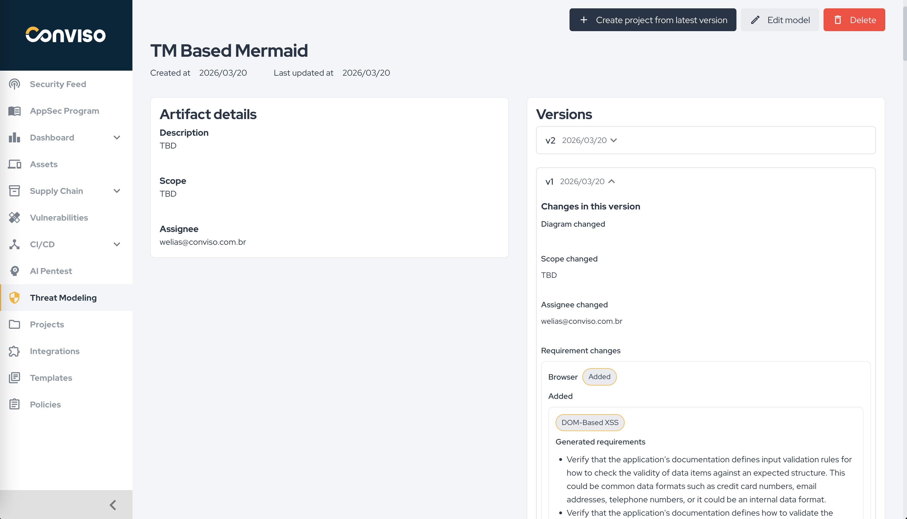

## Overview

The **Threat Modeling Artefact** page is the detailed view of a selected threat model.

It helps you review:

* the artifact metadata;
* the assigned user;
* the current and previous versions;
* changes introduced between versions;
* requirement changes generated from the model;
* the option to create a project from the latest version.

## Artifact Details

The left-side detail card shows the core information of the selected artifact:

* description;
* scope;
* assignee.

This gives a quick summary of what the model covers and who is responsible for it.

## Versions

The right-side panel is used to review the version history of the artifact.

From this section, you can:

* select different versions;
* compare changes introduced in previous versions;
* inspect scope changes;
* inspect assignee changes;
* review requirement additions and generated requirements.

This view is useful when the threat model evolves over time and the team needs traceability between updates.

## Main Actions

The page also provides direct actions to:

* **Create project from latest version**
* **Edit model**
* **Delete**

Use the project creation action when you want to turn the latest threat model version into a project that will be executed and tracked through requirements.

## When to Use This Page

Use this page when you need to:

* review the current state of a threat model;
* understand what changed between versions;
* verify how requirements were affected by a model update;
* create a project from the most recent version.
