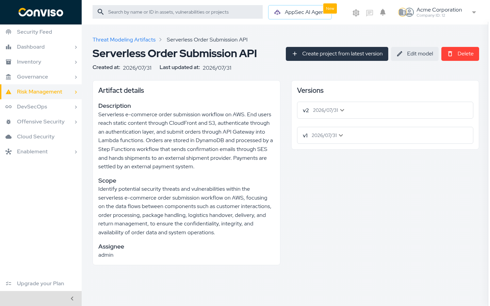
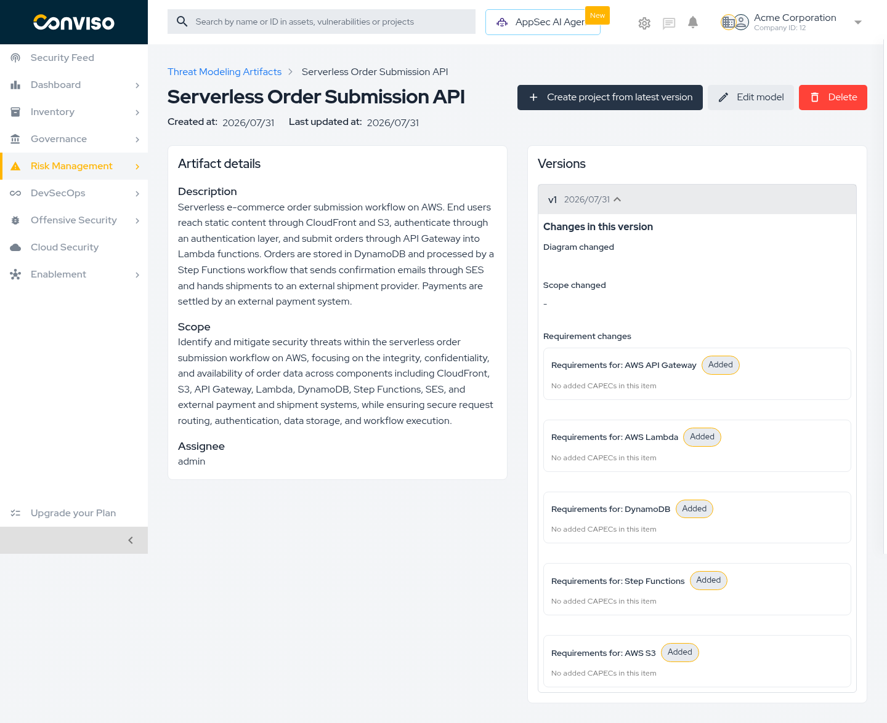
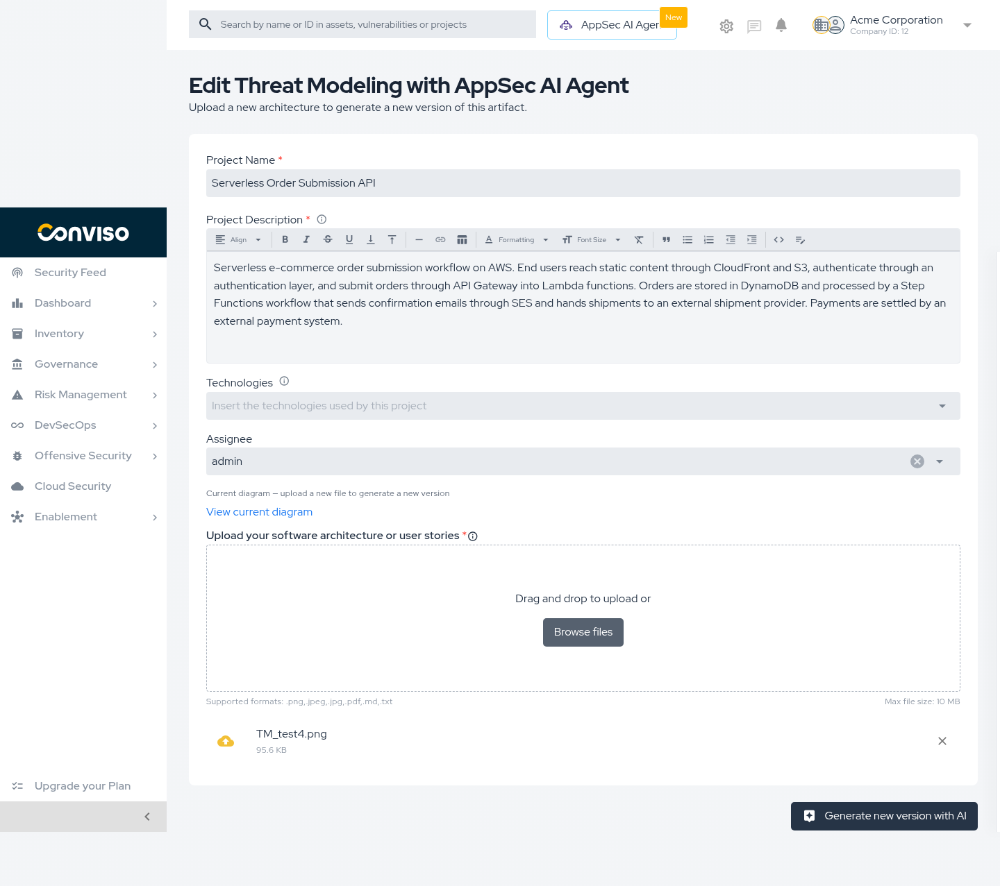

An artifact is the living record of one threat model. It is not a report you archive — it evolves with your system. Each time the architecture changes you generate a new version, and the platform keeps the full history.

## Objective

By the end of this guide, you will have:

- Read an artifact and understood what each part of the page means.
- Reviewed exactly what changed between two versions.
- Generated a new version after an architecture change.

## Prerequisites

- An existing threat modeling artifact. See [Create a Threat Model](./create-threat-modeling.md).
- For generating a new version with AI: the **AppSec AI Agent** enabled, and the updated architecture file (up to 10 MB).

## Steps

### Step 1 – Open the artifact

1. In the left-hand menu, click **Threat Modeling**.
2. Click the name of the artifact you want to review.

*Step 1: Artifact page with details on the left and the version history on the right.*

The left panel holds the current state of the model:

- **Description** — the system as you described it.
- **Scope** — what this threat model covers and protects.
- **Assignee** — who is responsible for it.

The right panel is the version history, most recent first.

The actions at the top of the page are:

| Action | What it does |
|---|---|
| **Create project from latest version** | Turns the newest version's requirements into an executable project. See [Turn Requirements into a Project](./management-projects-with-requirements-based-in-tm.md). |
| **Edit model** | Reopens the model so you can generate a new version. |
| **Delete** | Removes the artifact. |

### Step 2 – Review what changed in a version

1. Click a version in the **Versions** panel to expand it.
2. Read the change summary.

*Step 2: Expanded version showing diagram changes, scope changes, and the requirement groups added.*

The expanded version reports:

- **Diagram changed** — whether the architecture diagram differs from the previous version.
- **Scope changed** — whether the scope was rewritten.
- **Requirement changes** — which requirement groups were added or removed, one entry per architecture item.

This is what makes the history auditable: instead of comparing documents by hand, you see which parts of your security posture moved between versions.

### Step 3 – Generate a new version

When the architecture changes, add a version to the existing artifact instead of creating a new model, so the history stays in one place.

1. Click **Edit model**. The form reopens with your original data.
2. Update the description or technologies if they changed.
3. Click **Browse files** and attach the updated architecture file.
4. Click **Generate new version with AI** and wait about one minute.

*Step 3: Edit form with the current diagram linked and a new architecture file attached.*

Two things differ from the first generation: a **Current diagram** section with a link to the file already attached, and the button labelled **Generate new version with AI**.

:::tip
Generate a new version whenever the architecture actually changes — a new integration, a new data store, a new external provider. A stale threat model quietly stops protecting you.
:::

## Validation

| Check | Expected result |
|---|---|
| After generating | You return to the artifact page. |
| **Versions** panel | Shows **v2** above **v1**. |
| Expanding **v2** | Reports the diagram and scope changes, and the requirement groups added. |
| **Last updated at** | Shows today's date. |

## Troubleshooting

| Problem | What to do |
|---|---|
| **Edit model** does not open the form | Reload the page and try again. |
| Error message after generating | The agent could not complete the analysis, or the connection was not ready. Reload the page, reattach the file, and generate again. |
| The new version reports no changes | The uploaded diagram is identical to the previous one. Attach the updated file. |
| The scope no longer matches your system | Update the description as well as the diagram, then generate another version. |

## Next steps

- [Turn Requirements into a Project](./management-projects-with-requirements-based-in-tm.md)
- [Find and Manage Your Threat Models](./management-threat-modeling-artifacts.md)

## Support

Should you have any questions or require assistance while using the Conviso Platform, feel free to reach out to our dedicated support team.
