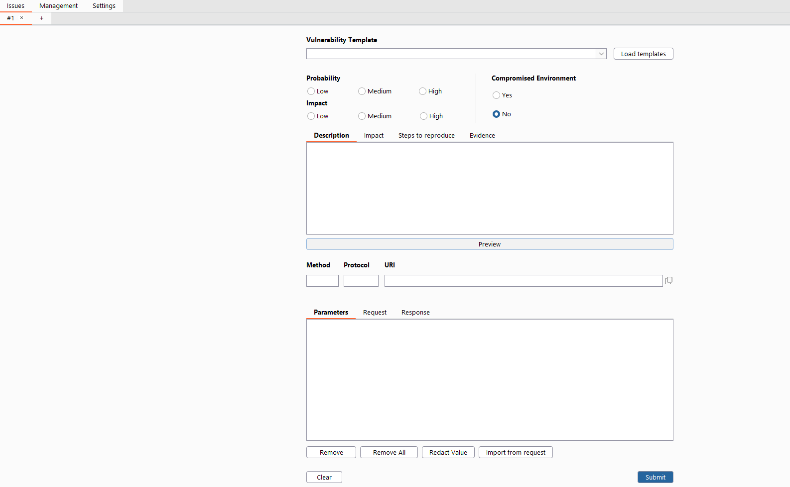
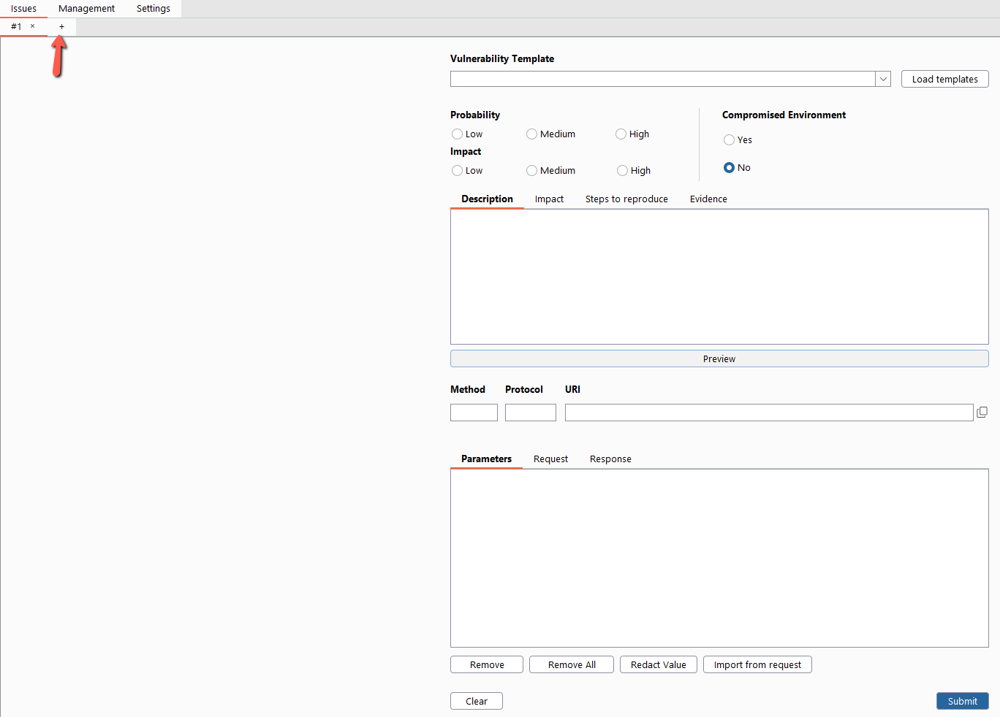
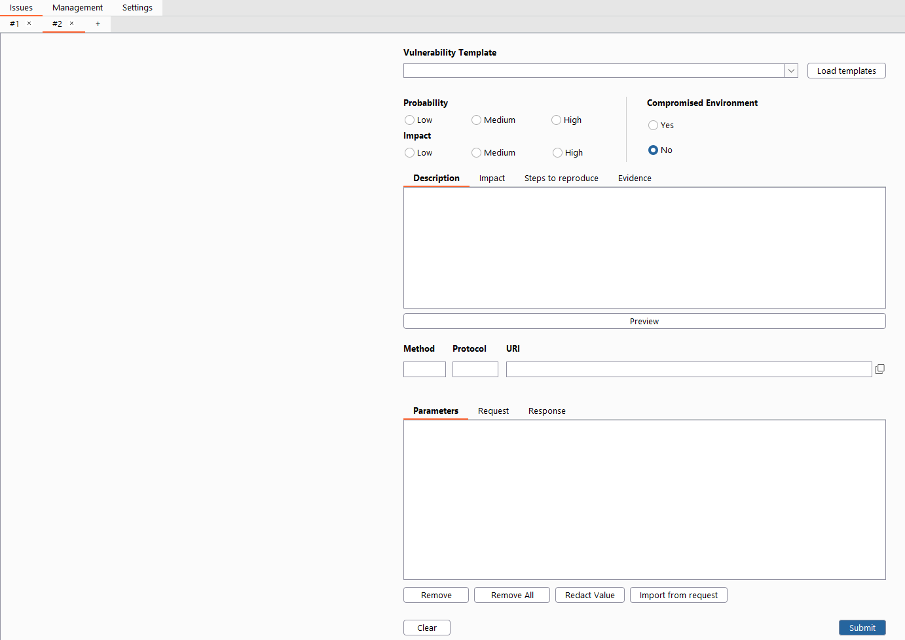

This is the new page used to submit new vulnerabilities. Now you can have **one or more pages** at the same time. To have access to more pages, just click on the tab that has the **plus(+) sign**.

More information about the [form](https://github.com/convisolabs/Burp-ConvisoPlatform/wiki/New-issue) and how to fill the camps.

### **1.** 

### **2.** 

### **3.** 
