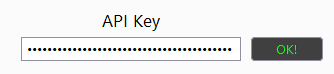
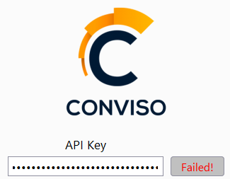
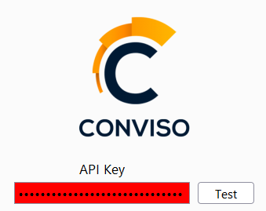

If you don't have an API Key yet, please follow these steps:
* [Getting API Key](../../../api/generate-apikey.md)

And then, let's test it. When testing the API KEY, we expect the result: 

A valid API Key will return

But there are also some common errors:

The expected format is a String with more than 40 and less than 50 characters. The image below shows an API key in the right format, but invalid.

The expected format is a String with more than 40 and less than 50 characters.

