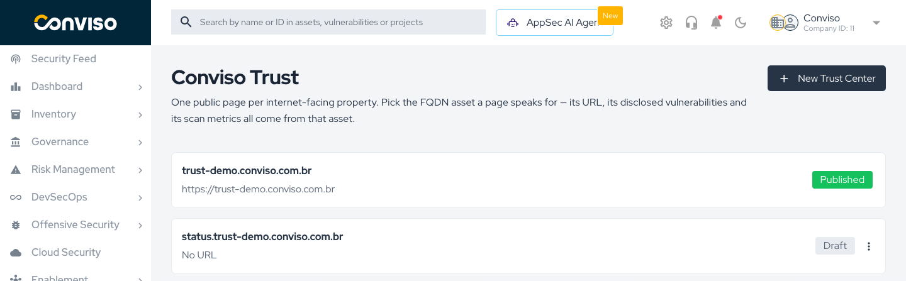
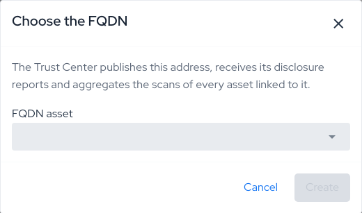
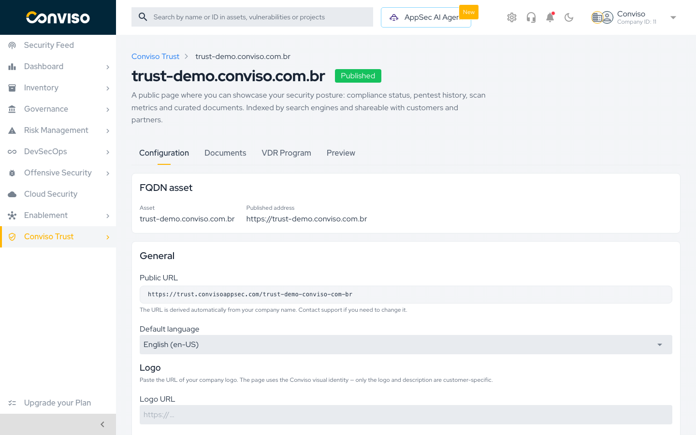
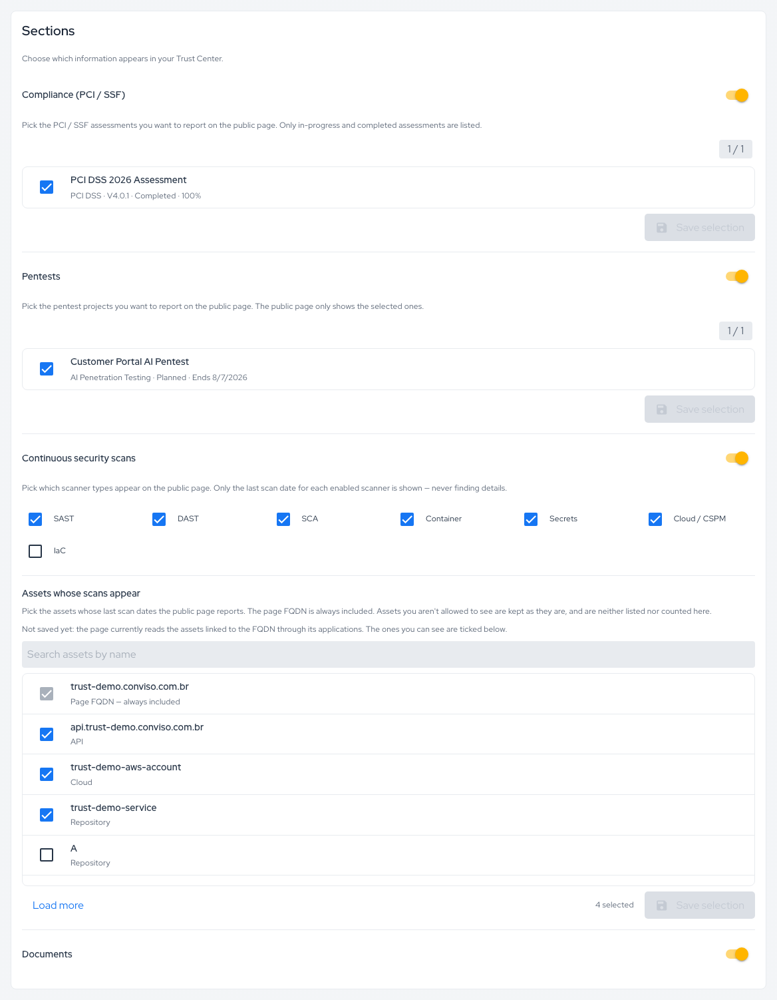
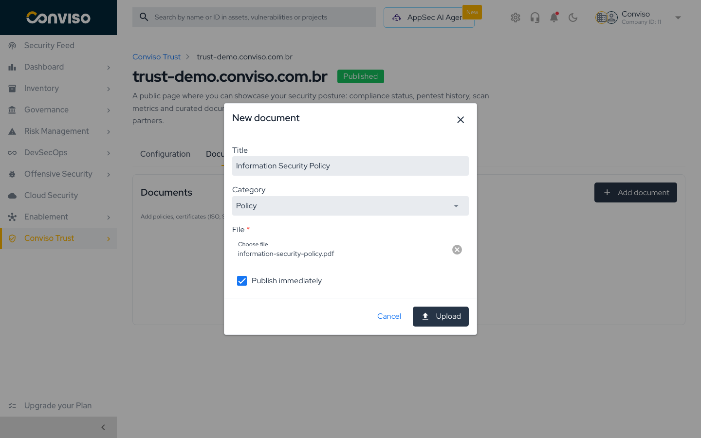
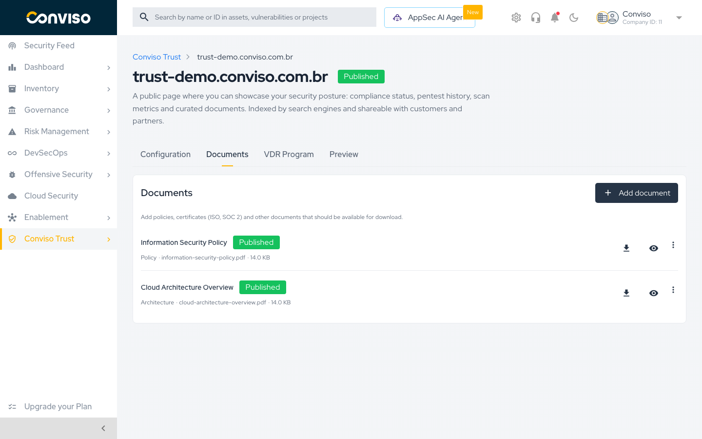
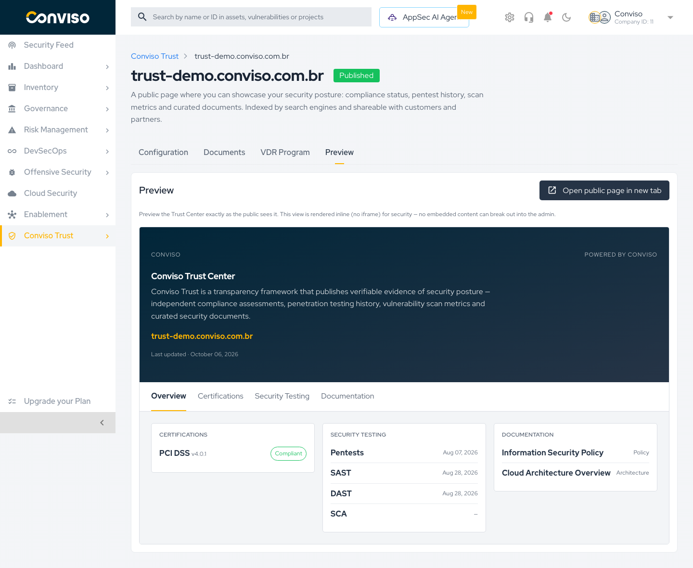
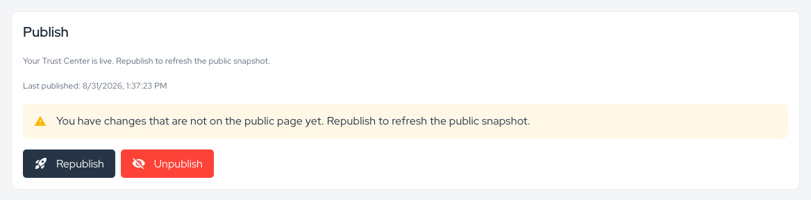
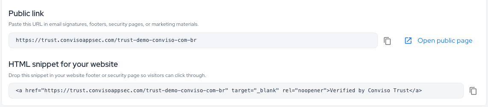
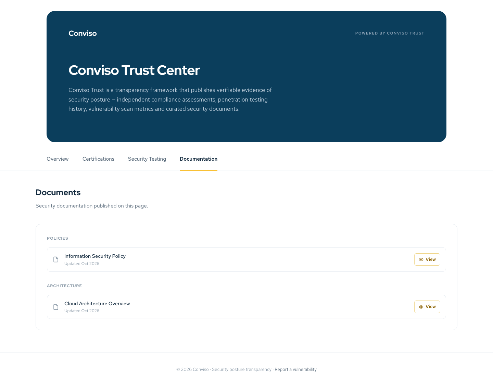

## Objective

Create a Trust Center for one of your internet-facing properties, choose the evidence it shows,
publish it at `https://trust.convisoappsec.com/<slug>` and share the link with your customers and
partners.

## Prerequisites

- An **FQDN asset** for the property, registered under **Inventory > Assets**, with its URL filled in
  and not archived. Each FQDN asset can have one Trust Center.
- Optional, depending on what the page will show:
  - PCI DSS, PCI PIN or PCI SSF assessments that are in progress or completed.
  - Pentest projects.
  - Scans of the FQDN asset or of the assets linked to it.
  - The documents you want to publish, as PDF, PNG or JPG files.

## Step 1: Create the Trust Center

1. Open **Conviso Trust > Trust Centers** in the side menu.

   

2. Select **New Trust Center**.
3. In **Choose the FQDN**, select the asset in **FQDN asset** and select **Create**.

   

The list offers only FQDN assets that are not archived and do not have a Trust Center yet. When no
asset qualifies, **New Trust Center** is disabled.

The new Trust Center opens on its **Configuration** tab, with the status **Draft**. Nothing is public
until you publish it.

Every Trust Center has four tabs:

| Tab               | Use it to                                                         |
| ----------------- | ----------------------------------------------------------------- |
| **Configuration** | Set the language and logo, choose the sections, publish and share |
| **Documents**     | Upload the documents visitors can download                        |
| **VDR Program**   | Enable the vulnerability report form and write your policy        |
| **Preview**       | See the page with your current settings before you publish        |

## Step 2: Set the Language and Logo

The **FQDN asset** card shows the asset the page belongs to and the **Published address**, the asset's
URL. Below it, the **General** card holds the page settings:

| Field                | What it does                                                                                                                                                       |
| -------------------- | ------------------------------------------------------------------------------------------------------------------------------------------------------------------ |
| **Public URL**       | Read-only. The address of the public page, derived from the host name of the FQDN asset. It is fixed after the first publish                                       |
| **Default language** | `English (en-US)` or `Portuguese (pt-BR)`. The whole public page uses this language, and visitors cannot switch. **New Trust Centers start in Portuguese**          |
| **Logo URL**         | Optional. An `https://` address of your company logo. When empty, the page shows your company name instead                                                        |

Select **Save configuration**. The platform confirms with `Configuration saved`.

:::caution Save configuration also saves the Sections card
**Save configuration** stores the language, the logo **and** the section switches and scan types of
the next step. Select it again after you change any of them.
:::

## Step 3: Choose What the Page Shows

The **Sections** card controls which information appears on the public page. Each section has a
switch; all four start on.

### Compliance (PCI / SSF)

Lists the company's PCI DSS, PCI PIN and PCI SSF assessments that are **in progress or completed**.
Select the ones to report and select **Save selection**. The counter shows how many are selected.

### Pentests

Lists the company's penetration testing projects. Select the ones to report and select
**Save selection**. The public page counts only the selected projects, and dates each test by the
project's end date.

### Continuous Security Scans

Select the scan types to report: **SAST**, **DAST**, **SCA**, **Container**, **Secrets**,
**Cloud / CSPM** and **IaC**. For each one, the public page shows only the date of the last successful
scan, **never the findings**. A scan type with no successful scan is not listed. The scan types are
saved with **Save configuration**.

To stop showing scans, turn off **Continuous security scans** instead of clearing every scan type.

#### Assets whose scans appear

This list decides which assets' scans count. The FQDN asset itself is always included.

- **Until you save a selection**, the page reads the FQDN asset and the assets linked to it through
  your applications: its APIs, and the repositories and cloud assets connected to the FQDN or to
  those APIs. The list shows those assets already ticked.
- **After you select Save selection**, the page reads exactly the FQDN asset plus the assets you
  ticked. Use **Search assets by name** and **Load more** to find other assets. From then on, the
  selection is kept as saved, even when new assets are linked to the FQDN; archived assets drop out
  on their own. There is no way back to the automatic list.

Assets you are not allowed to see are not listed and are kept as they are when you save.

### Documents

The **Documents** switch shows or hides the Documentation tab. The documents themselves are managed in
the next step.

:::note When selections reach the public page
Turning a section on or off takes effect on the public page as soon as you select
**Save configuration**. New assessment, pentest, scan type and scan asset selections reach the public
page at the next publish.
:::

## Step 4: Add Documents

1. Open the **Documents** tab and select **Add document**.
2. Fill in the **New document** dialog:

   | Field                   | Notes                                                                          |
   | ----------------------- | ------------------------------------------------------------------------------ |
   | **Title**               | Required, up to 200 characters. Visitors see this title                        |
   | **Category**            | `Policy` (default), `Certification`, `Architecture` or `Other`                 |
   | **File**                | A PDF, PNG or JPG file, up to 10 MB                                             |
   | **Publish immediately** | On by default. When off, the document is saved as a draft and stays off the page |

   

3. Select **Upload**. The platform confirms with `Document added`.

Each document row shows its title, its status (**Published** or **Draft**), its category, file name and
size, and three actions:

- **Download**: downloads the file.
- **Hide from the public page** / **Show on the public page** (eye icon): changes the document status.
- **⋮ > Delete**: deletes the document after confirmation.

A new document reaches the public page at the next publish. Hiding or deleting a document removes it
from the public page right away. To change a title or replace a file, delete the document and upload
it again.

## Step 5: Preview the Page

Open the **Preview** tab to see the page built from the current platform data and your saved settings,
which is what visitors would see if you republished now.

The preview is a close approximation of the public page, with some differences:

- It uses **your** platform language, not the Trust Center's **Default language**.
- It does not show the VDR block, the footer or download links.
- Scan types without a scan appear with `—`; the public page leaves them out.

To see the page exactly as published, select **Open public page in new tab**.

## Step 6: Publish

Go back to the **Configuration** tab. The **Publish** card shows whether the page is live and when it
was last published.

1. Select **Publish**. For a page that is already live, the button reads **Republish**.
2. The platform confirms with `Trust Center published`, and the status changes to **Published**.

Publishing takes a snapshot of the evidence (assessments, penetration tests, scan dates and the
document list) and updates the public site. On the **first** publish, the address can take a few
minutes to start answering.

While the page is live, the warning
`You have changes that are not on the public page yet. Republish to refresh the public snapshot.`
appears after you save changes in the current browser tab. It does not track new platform data, such
as a scan that has just finished. **Republish whenever you want the page to reflect new evidence**:
nothing republishes on its own.

**Publish** is disabled while the FQDN asset blocks publishing. The **FQDN asset** card explains why:

| Message                                                                 | What to do                                                    |
| ----------------------------------------------------------------------- | ------------------------------------------------------------- |
| `The FQDN asset is archived. Restore it before publishing.`             | Restore the asset under **Inventory > Assets**                |
| `The FQDN asset has no URL. Fill it in on the asset before publishing.` | Edit the asset and fill in its URL                            |
| `The FQDN asset was deleted. Point this page at another asset.`         | The page cannot be moved to another asset; contact support    |

## Step 7: Share the Page

Once the page is live, the **Share your Trust Center** card at the bottom of the **Configuration** tab
gives you two ways to point people to it:

- **Public link**: copy the address, or select **Open public page**. Use it in e-mail signatures,
  security questionnaires, sales material and your website's security page.
- **HTML snippet for your website**: a ready-made `Verified by Conviso Trust` link to paste into your
  website's footer or security page.

## Validation

- The Trust Center shows **Published** in the list and in its page header.
- The **Publish** card shows the time of your publish under **Last published**.
- The public link opens the page in the default language you chose, with the sections and documents
  you expect. Check the **Certifications**, **Security Testing** and **Documentation** tabs.

## Unpublishing and Deleting

**Unpublish** takes the page offline immediately. Confirm with **Yes, unpublish** in the dialog
`Are you sure you want to unpublish? Your Trust Center will become unreachable.` Visitors then see
`Trust Center not found`, and the VDR report form stops accepting reports. Reports already in the
Disclosure Inbox stay there. Publishing again brings the page back at the same address.

**Delete** is available only for a Trust Center that was **never published**: open the **⋮** menu on
its card in the list and select **Delete**. Deleting removes the page, its documents and its
disclosure policy, with no undo. The selected assessments and pentest projects are not deleted, only
unselected. A Trust Center that has been published can only be unpublished.

## Related Areas

- [Conviso Trust overview](./trust-overview.md): what the public page shows and what is snapshotted.
- [Vulnerability Disclosure (VDR)](./vulnerability-disclosure.md): add a vulnerability report form to
  the page and triage the reports.
- [Asset Management](../platform/asset-management.md): FQDN assets and their relationships.

## Support

Should you have any questions or require assistance while configuring your Trust Center, feel free to reach out to our dedicated support team.
