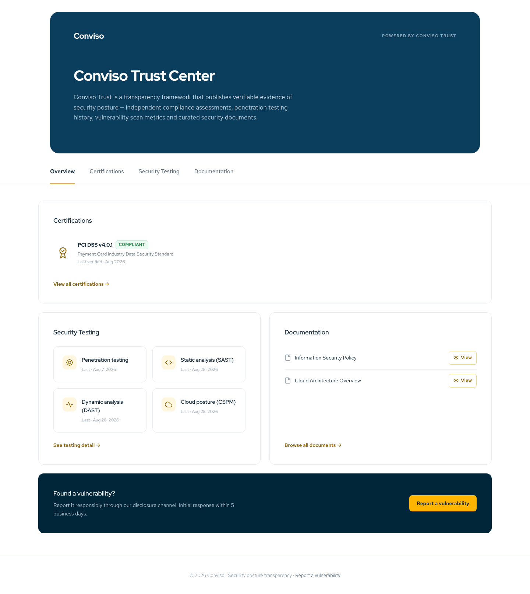
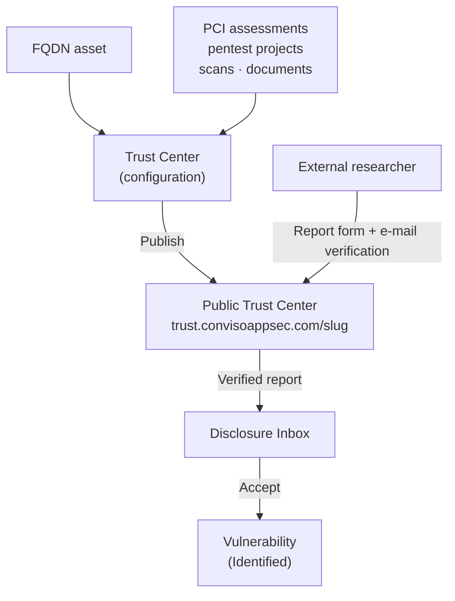

## Overview

**Conviso Trust** turns what Conviso Platform already knows about an internet-facing property into a
public page, the **Trust Center**, that your customers, partners and prospects can open without an
account. It also gives external security researchers a way to report vulnerabilities to you: a
**Vulnerability Disclosure (VDR) program** whose reports arrive in the platform's **Disclosure Inbox**.

Conviso Trust has three parts:

| Part                 | Where you manage it                       | What it does                                                                                                      |
| -------------------- | ----------------------------------------- | ----------------------------------------------------------------------------------------------------------------- |
| **Trust Center**     | **Conviso Trust > Trust Centers**         | A public page for one FQDN asset: compliance assessments, penetration testing history, last scan dates, documents |
| **VDR program**      | The **VDR Program** tab of a Trust Center | A disclosure policy and a report form on the public page                                                          |
| **Disclosure Inbox** | **Conviso Trust > Disclosure Inbox**      | Where your team triages verified reports, messages the researcher and turns a report into a vulnerability         |



## How It Fits Together

A Trust Center is attached to one **FQDN asset**. That asset gives the page its public address and is
the starting point for the scan activity it reports. You choose which compliance assessments,
penetration tests and documents the page shows. When you **publish**, the platform takes a snapshot
of that evidence and puts the page online.



The public page **never shows findings**. It shows statuses and dates only: whether an assessment is
compliant or in progress, when the last penetration test ended and when each type of scan last ran.
Vulnerability counts, severities and finding details stay in the platform.

## The Public Page

Each Trust Center has its own address:

```text
https://trust.convisoappsec.com/<slug>
```

The **slug** is derived from the host name of the FQDN asset. For example, the asset
`trust-demo.conviso.com.br` publishes at `https://trust.convisoappsec.com/trust-demo-conviso-com-br`.
The slug is fixed after the first publish, and it cannot be edited. Anyone with the link can open the
page; visitors do not need an account.

The page uses the Conviso Trust visual identity. What identifies your company is its name and,
optionally, your logo. The whole page is shown in the Trust Center's **Default language**, English or
Portuguese; visitors cannot switch languages.

The page is organized in tabs. **Overview** is always shown. The other tabs appear only when they have
something to show:

| Tab                  | What it shows                                                                                                               | Where the data comes from                                                                         |
| -------------------- | --------------------------------------------------------------------------------------------------------------------------- | ------------------------------------------------------------------------------------------------- |
| **Certifications**   | Each selected assessment as `Compliant`, with the month it was last verified, or `In progress`, with its completion rate     | The PCI DSS, PCI PIN and PCI SSF assessments you select, when they are in progress or completed   |
| **Security Testing** | How many penetration tests were executed, the most recent one and, for each enabled scan type, the date of the last scan     | The pentest projects you select (dated by their end date) and successful scans of selected assets |
| **Documentation**    | Your documents, grouped into Policies, Certifications, Architecture and Other, each with a **View** button that downloads it | The documents you upload to the Trust Center                                                      |

When the VDR program is enabled, the Overview tab also shows a **Found a vulnerability?** block with a
**Report a vulnerability** button, and the footer links to the report form. See
[Vulnerability Disclosure (VDR)](./vulnerability-disclosure.md).

## Snapshot and Live Settings

Publishing freezes the **evidence** in a snapshot. Your **settings** apply to the public page as soon
as you save them.

| Updated only when you publish or republish                    | Applied as soon as you save                                    |
| ------------------------------------------------------------- | -------------------------------------------------------------- |
| Compliance assessments and their progress                     | Turning a section on or off                                    |
| Penetration tests: count, most recent date, tests per year    | Logo and default language                                      |
| Last scan date per scan type, and which scan types are listed | Hiding or deleting a document                                  |
| The list of documents                                         | Everything in the VDR program, including the disclosure policy |

Nothing republishes on its own. A scan that ran yesterday, a penetration test that just ended or a
document you uploaded reaches the public page only after you select **Republish**. See
[Configuring a Trust Center](./configuring-a-trust-center.md#step-6-publish).

## What to Read Next

- [Configuring a Trust Center](./configuring-a-trust-center.md): create a Trust Center, choose what it
  shows, add documents, publish and share it.
- [Vulnerability Disclosure (VDR)](./vulnerability-disclosure.md): enable the VDR program and follow
  the researcher's side of the process.
- [Disclosure Inbox](/trust/vulnerability-disclosure?tab=disclosure-inbox): find, triage, answer and
  accept the reports, in the **Disclosure Inbox** tab of the VDR page.

## Related Areas

- [Asset Management](../platform/asset-management.md): the FQDN assets a Trust Center is attached to.
- [PCI Compliance](../compliance/pci-overview.md): the assessments the Certifications tab reports.
- [Projects](../platform/projects.md): the pentest projects the Security Testing tab reports.
- [Vulnerabilities](../platform/vulnerabilities.md): where an accepted report continues as a vulnerability.

## Support

Should you have any questions or require assistance while using Conviso Trust, feel free to reach out to our dedicated support team.
