import Tabs from '@theme/Tabs';
import TabItem from '@theme/TabItem';

## Overview

A **Vulnerability Disclosure (VDR) program** gives external security researchers a documented, safe
way to tell you about a vulnerability they found in your systems. When you enable it on a
[Trust Center](./trust-overview.md), the public page gets a **Report a vulnerability** button that
leads to your disclosure policy and a report form. Reports reach your team in the
**Disclosure Inbox** only after the researcher confirms their e-mail address.

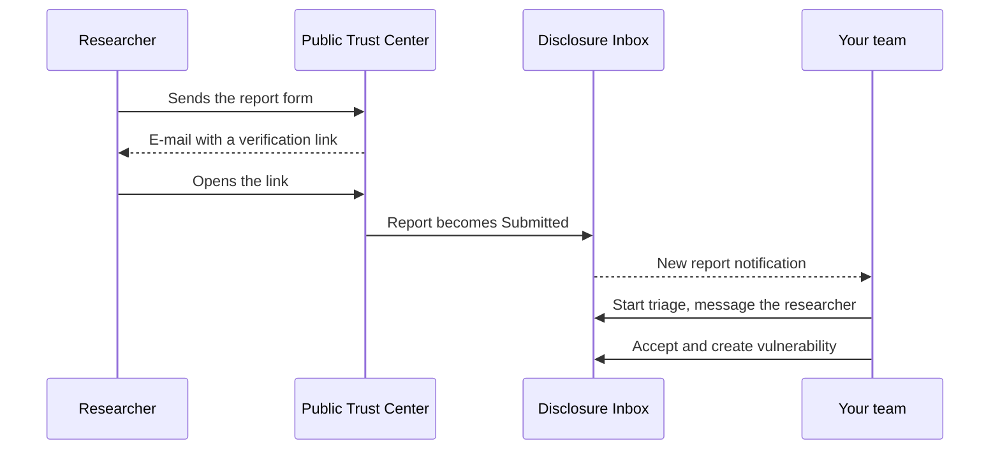

Use the tabs below:

- **How VDR works**: enabling the program, writing the policy, and what the researcher sees and
  receives.
- **Disclosure Inbox**: how your team finds, triages, answers, accepts and closes reports.

## Report Statuses

Every report has one of seven statuses. Statuses only move forward: a report never returns to an
earlier status, and reports cannot be deleted.

| Status                   | Meaning                                                                                                           | Can move to                                    |
| ------------------------ | ----------------------------------------------------------------------------------------------------------------- | ---------------------------------------------- |
| **Pending verification** | The researcher has not opened the verification link yet. Your team cannot act on the report                       | **Submitted**, when the researcher verifies    |
| **Submitted**            | Verified and waiting for your team                                                                                | **Triaging**, **Accepted**, **Duplicate**, **Invalid** |
| **Triaging**             | A team member started triage and is the report's **Triager**                                                      | **Accepted**, **Duplicate**, **Invalid**       |
| **Accepted**             | Your team created a vulnerability from the report                                                                 | **Resolved**                                   |
| **Duplicate**            | Closed as a duplicate of something you already know                                                               | None                                           |
| **Invalid**              | Closed as not valid                                                                                               | None                                           |
| **Resolved**             | Closed after the vulnerability was fixed                                                                          | None                                           |

Researchers do not see these statuses and are not e-mailed when they change. They hear from you only
through the messages your team sends from the inbox.

## Before You Start

- A **published** Trust Center. The report form works only while the page is published. See
  [Configuring a Trust Center](./configuring-a-trust-center.md).

<Tabs queryString="tab">
<TabItem value="how-vdr-works" label="How VDR works" default>

### Enable the VDR Program

1. Open **Conviso Trust > Trust Centers**, select the Trust Center and open the **VDR Program** tab.
2. Turn on **Enable VDR program on this Trust Center**.
3. Fill in the program:

   | Field                                 | Notes                                                                                                                                                         |
   | ------------------------------------- | ------------------------------------------------------------------------------------------------------------------------------------------------------------- |
   | **Security contact email (optional)** | Shown on the report page as an alternative way to reach you, for example when the form is unavailable                                                         |
   | **Response SLA (business days)**      | A whole number from 1 to 365; `5` by default. The public page promises `Initial response within N business days.`                                             |
   | **Policy body (Markdown)**            | Your disclosure policy: scope, how to report, safe harbor and response times. It starts from a template and accepts up to 8,000 characters                    |

4. Select **Save policy**. The platform confirms with `Policy saved.`

The program applies to the public page as soon as you save it; you do not need to republish. To stop
receiving reports, turn the switch off and save.

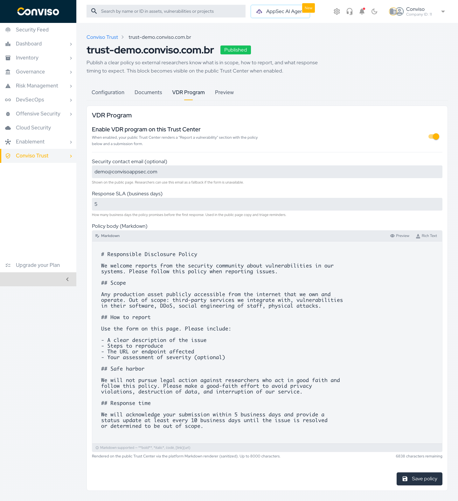

:::tip Edit the policy template in Markdown mode
The template is written in Markdown. In the editor's default **Rich Text** mode, it appears as a single
block of text without line breaks. Select the **Markdown** button in the editor toolbar to see and edit
it with its headings and lists, and **Preview** to check how it renders.
:::

:::caution Review the template's commitments
The template states that you will acknowledge a report within 5 business days and send an update at
least every 10 business days. These numbers do not follow the **Response SLA** field. Edit them to
match what your team commits to.
:::

### What Researchers See

With the program enabled, the Overview tab of the public page shows a **Found a vulnerability?** block
with your response SLA and a **Report a vulnerability** button, and the footer links to the same form.

The report page, at `https://trust.convisoappsec.com/<slug>/disclosure`, shows:

- The heading **Report a vulnerability**.
- Your policy under **Disclosure policy**, with the line `Initial response within N business days.` A
  long policy is collapsed behind **See full policy**.
- `or contact directly:` followed by your security contact e-mail, when you set one.
- The report form.

| Field                             | Required | Limits                                                                     |
| --------------------------------- | -------- | -------------------------------------------------------------------------- |
| **Title**                         | Yes      | 10 to 200 characters                                                       |
| **Description**                   | Yes      | 50 to 10,000 characters                                                    |
| **Severity estimate (optional)**  | No       | `Unknown` (default), `Low`, `Medium`, `High` or `Critical`                 |
| **Affected URL (optional)**       | No       | Up to 500 characters                                                       |
| **Steps to reproduce (optional)** | No       | Up to 20,000 characters                                                    |
| **Your name (optional)**          | No       | Up to 200 characters                                                       |
| **Your email**                    | Yes      | Used to verify the report and to receive your team's messages; not public  |

The researcher completes a CAPTCHA and selects **Send report**. The form does not accept file
attachments.

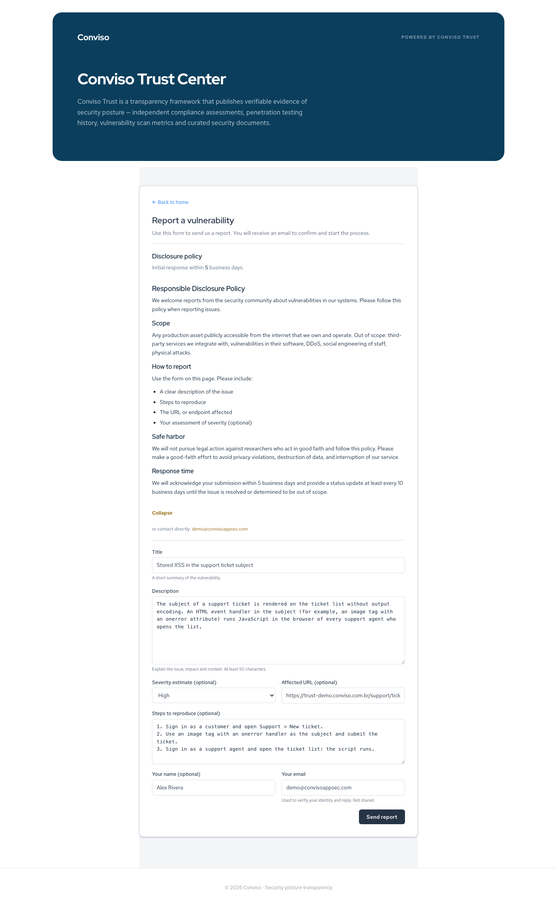

### E-mail Verification

After **Send report**, the researcher sees **Check your inbox** and receives an e-mail with a
verification link. Until they open it, the report is **Pending verification**: it stays out of the
inbox's default view and your team is not notified.

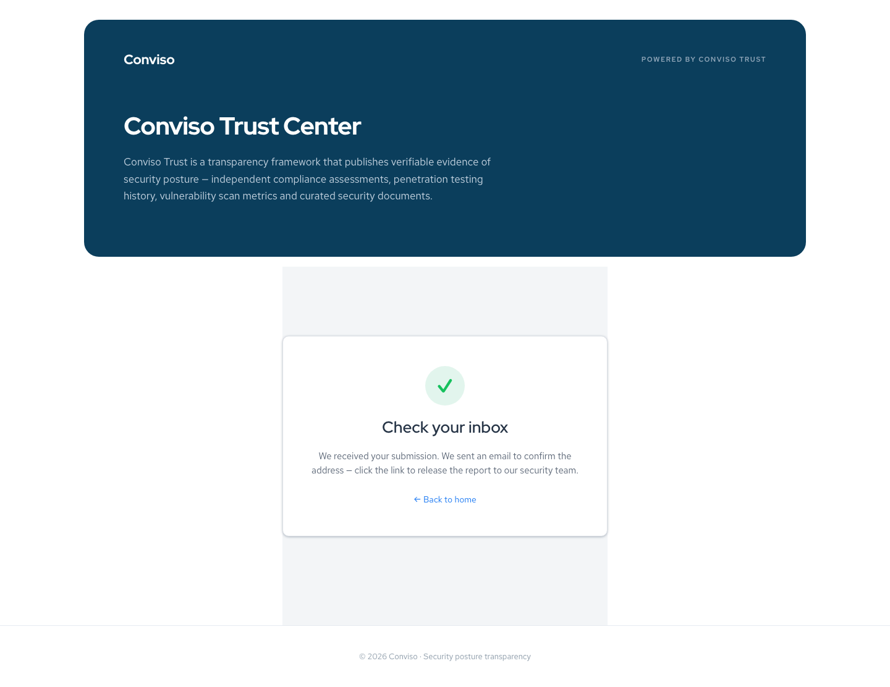

Opening the link confirms the report. The researcher sees **Thank you!** with your first response
time, the report becomes **Submitted**, and your team is notified.

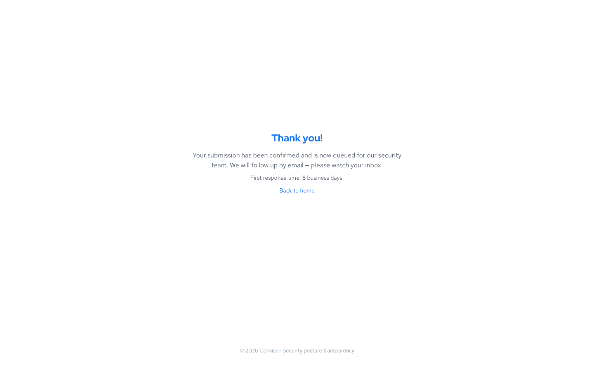

The verification link:

- Is valid for **7 days from the moment the report was sent** and works **once**. An expired or used
  link shows **Invalid or expired link**, with a **Submit again** option.
- Cannot be sent again. If it expires, the report stays **Pending verification** for good and your team
  cannot act on it; the researcher has to send a new report.

### After Verification

- The researcher receives, by e-mail, **only the messages your team sends** from the Disclosure Inbox.
  Status changes, including the acceptance of the report, are not e-mailed.
- Messages are **one-way**. Researchers cannot reply through Conviso Trust. When you need more
  information, say in your message how the researcher can reach you, for example through your security
  contact e-mail.

### Abuse Protection

- The form requires a CAPTCHA.
- The number of reports accepted from the same IP address and from the same e-mail address in a
  period is limited. A researcher over the limit sees
  `We could not process your submission. Please try again later.`
- The platform escapes HTML in everything a researcher types, so HTML and scripts sent through the
  form are never rendered.

</TabItem>
<TabItem value="disclosure-inbox" label="Disclosure Inbox">

### Open the Inbox

Open **Conviso Trust > Disclosure Inbox**. A company has one inbox, with the reports of every Trust
Center you have access to. The inbox does not say which Trust Center a report came through; the
**Affected URL** usually tells you.

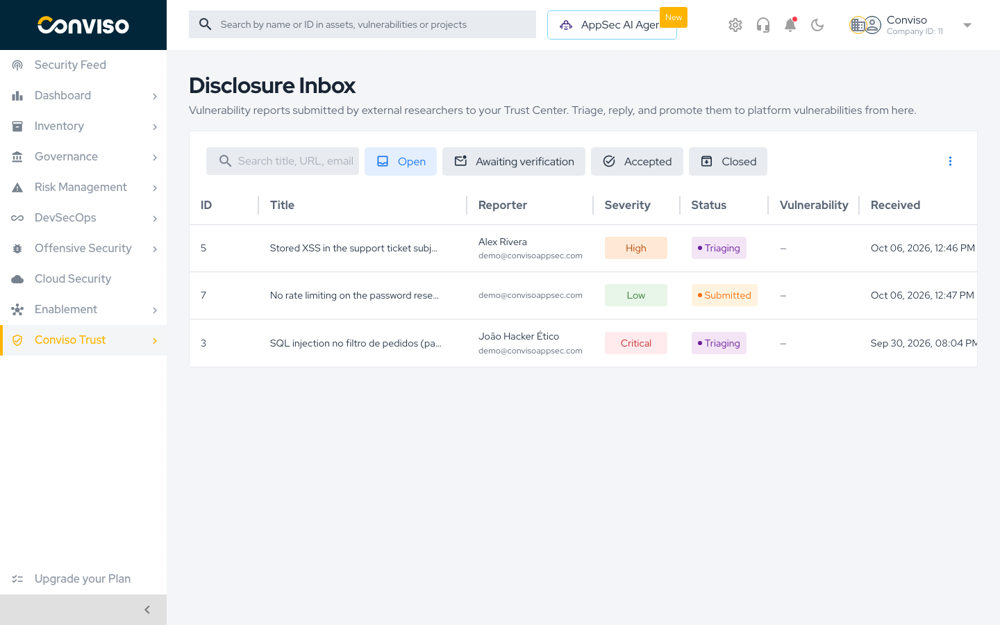

### Find Reports

The quick filters above the table select reports by status. **Open** is selected when the page loads.
You can combine filters; with every filter off, the list shows all statuses.

| Filter                    | Shows                                         |
| ------------------------- | --------------------------------------------- |
| **Open**                  | **Submitted** and **Triaging** reports        |
| **Awaiting verification** | **Pending verification** reports              |
| **Accepted**              | **Accepted** reports                          |
| **Closed**                | **Resolved**, **Duplicate** and **Invalid** reports |

The search box, **Search title, URL, email**, looks for text in the report title, the affected URL and
the researcher's e-mail, together with the selected filters.

| Column            | Shows                                                                                        |
| ----------------- | -------------------------------------------------------------------------------------------- |
| **ID**            | The report number                                                                            |
| **Title**         | The researcher's title. Select it to open the report                                         |
| **Reporter**      | The researcher's name, when given, and e-mail                                                |
| **Severity**      | The researcher's estimate                                                                    |
| **Status**        | The report status                                                                            |
| **Vulnerability** | A link to the vulnerability created from the report                                         |
| **Received**      | When the report was sent                                                                     |

**Triager** and **Updated** columns are hidden by default. Select **⋮ > Columns** at the top right of
the table to show, hide and reorder columns, or **Reset to default**. The layout is saved in your
browser.

The list loads the **100 most recently updated** reports. When there are more, a warning asks you to
narrow the filters or the search.

### Review a Report

Select a report to open it. The header shows when it was received and updated, the researcher's
**Estimated severity**, the **Status**, and the actions available for that status.

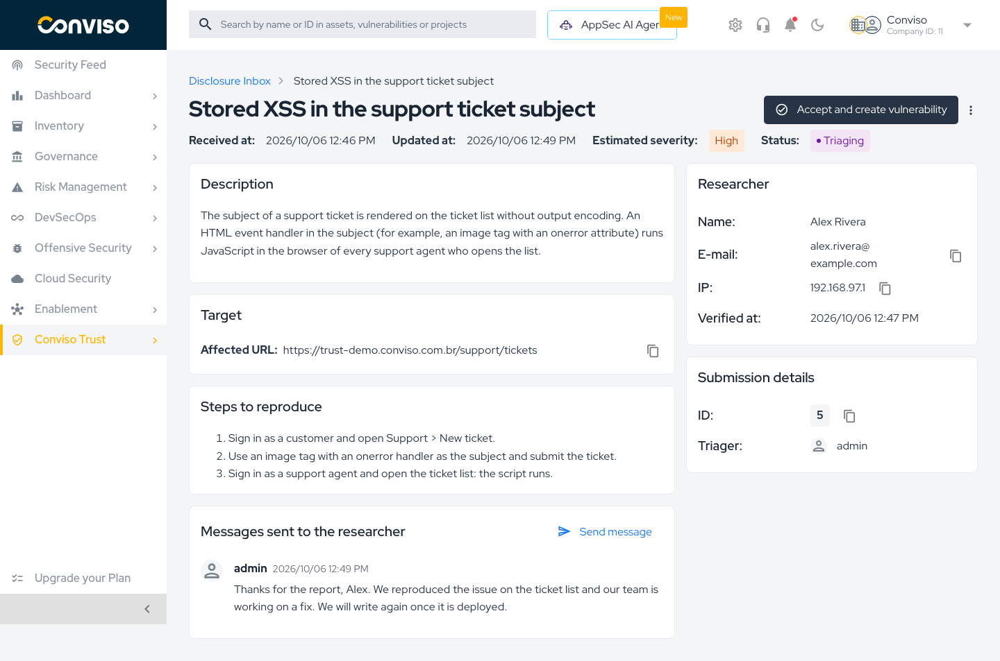

| Card                                | Content                                                                         |
| ----------------------------------- | ------------------------------------------------------------------------------- |
| **Description**                     | The researcher's description                                                    |
| **Target**                          | The **Affected URL**, when given                                                |
| **Steps to reproduce**              | The researcher's steps, when given                                              |
| **Messages sent to the researcher** | Every message your team sent, oldest first, and the **Send message** button     |
| **Researcher**                      | **Name**, **E-mail**, the **IP** the report came from, and **Verified at**      |
| **Submission details**              | The report **ID** and its **Triager**                                           |

:::caution Treat report content as untrusted
Web addresses in the description and the steps are clickable. Open them with the same care as any
link from an unknown sender.
:::

The actions depend on the status:

| Status                                          | Actions                                                                                                  |
| ----------------------------------------------- | -------------------------------------------------------------------------------------------------------- |
| **Pending verification**                        | None. The banner `Waiting for the researcher to confirm their e-mail.` explains why                      |
| **Submitted**                                   | **Start triage**, **Accept and create vulnerability**, and **⋮ > Mark as duplicate / Mark as invalid**   |
| **Triaging**                                    | **Accept and create vulnerability**, and **⋮ > Mark as duplicate / Mark as invalid**                     |
| **Accepted**                                    | **Mark as resolved**                                                                                     |
| **Duplicate**, **Invalid**, **Resolved**        | None                                                                                                     |

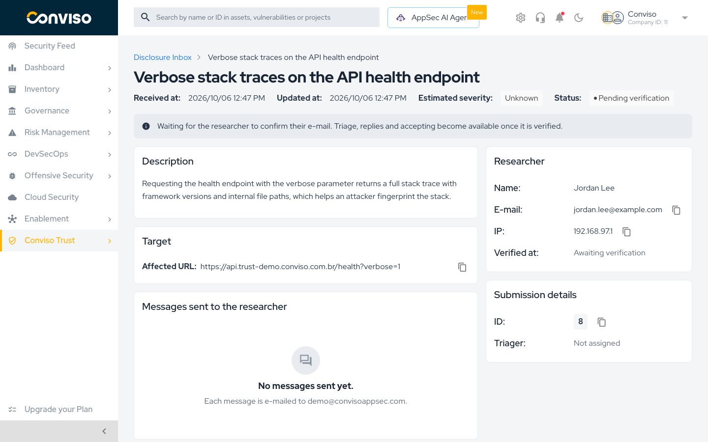

In the list, the **⋮** menu of each row also offers **Mark as duplicate** and **Mark as invalid** for
open reports, and **Mark as resolved** for accepted ones.

### Start Triage

On a **Submitted** report, select **Start triage**. The report moves to **Triaging** and you become its
**Triager**. Triage is optional: you can accept or close a report straight from **Submitted**. A report
cannot be reassigned; the **Triager** is the person who started triage.

### Message the Researcher

1. On the report, select **Send message**.
2. Write the message in **Message**. Markdown is supported, up to 20,000 characters.
3. Select **Send**. The platform confirms with `Message sent.`

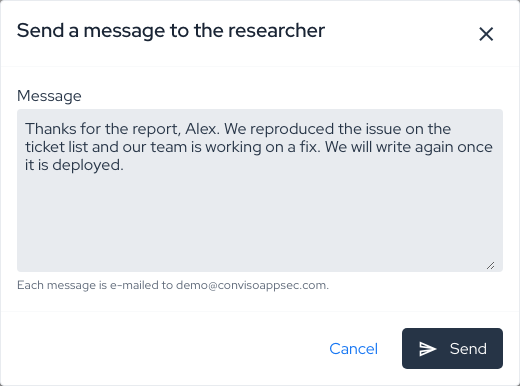

Every message is e-mailed to the researcher and listed under **Messages sent to the researcher**.
There are no internal notes: anything you write here goes to the researcher. **Send message** is not
available while the report is **Pending verification** or after it is marked **Invalid**.

### Accept and Create a Vulnerability

1. On a **Submitted** or **Triaging** report, select **Accept and create vulnerability**.
2. Review the dialog:

   | Field                                  | Notes                                                                                                                                                         |
   | -------------------------------------- | ------------------------------------------------------------------------------------------------------------------------------------------------------------- |
   | **Asset**                              | Empty by default, which files the vulnerability against the Trust Center's FQDN asset. You can pick an asset that the FQDN reaches, such as its API or repository |
   | **Project (optional)**                 | Links the vulnerability to a project. The project must have linked assets, and a retest project must include the vulnerability's asset                         |
   | **Final severity**                     | `Low`, `Medium`, `High` or `Critical`. Starts from the researcher's estimate, or `High` when the estimate is `Unknown`                                         |
   | **Vulnerability title**                | Starts with the researcher's title                                                                                                                            |
   | **Impact level**, **Probability level** | `Low`, `Medium` or `High`; `Medium` by default                                                                                                                |
   | **Suggested remediation (optional)**   | When empty, the vulnerability gets a standard text pointing back to the report                                                                                |
   | **Compromised environment confirmed**  | Off by default                                                                                                                                                |

   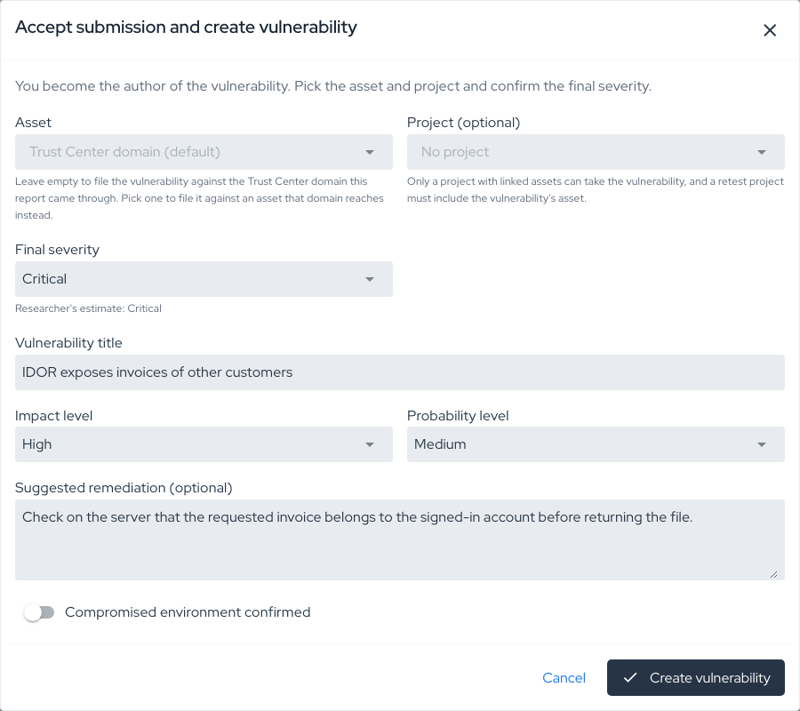

3. Select **Create vulnerability**. The platform confirms with `Vulnerability #<id> created.`

The report becomes **Accepted**, and its header links to the new vulnerability under
**Vulnerability**. The vulnerability:

- Is a web vulnerability in **Identified** status, on the asset you picked or on the FQDN asset.
- Has you as its author, and the researcher's title, description and steps to reproduce.
- Does not carry the researcher's name or e-mail; they stay on the report.

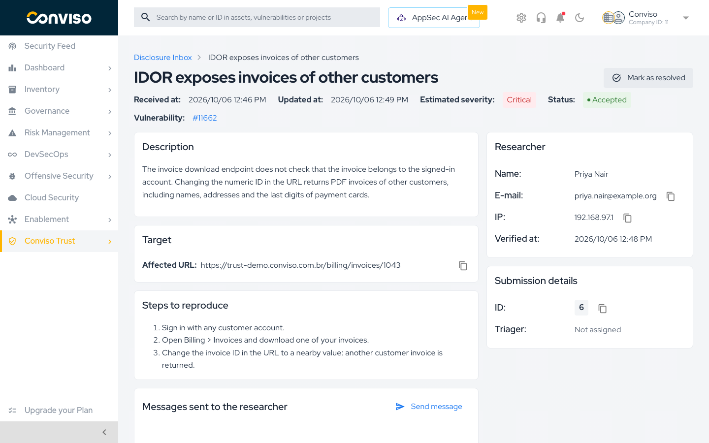

From here on, work the vulnerability as any other in [Vulnerabilities](../platform/vulnerabilities.md).
The researcher is not told about the acceptance; send a message if you want to let them know.

### Close a Report

| Action                | Available on                  | Effect                                                                                                          |
| --------------------- | ----------------------------- | --------------------------------------------------------------------------------------------------------------- |
| **Mark as duplicate** | **Submitted**, **Triaging**   | Leaves the open queue for good. You can still message the researcher                                            |
| **Mark as invalid**   | **Submitted**, **Triaging**   | Leaves the open queue for good. You can no longer message the researcher                                         |
| **Mark as resolved**  | **Accepted**                  | Closes the report once its vulnerability is fixed. It is not automatic: fixing the vulnerability does not resolve the report |

Each action asks for confirmation and cannot be undone.

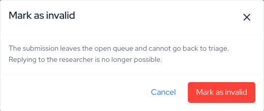

:::tip Tell the researcher before you close
Closing a report does not notify the researcher. Send your explanation **before** you select
**Mark as invalid**, because messaging is disabled afterwards.
:::

### Team Notifications

When a researcher verifies a report, Conviso Platform notifies the users who can see it. The
notification carries the report title, the estimated severity, the researcher's e-mail and a link to
the report. It is always sent and cannot be turned off in notification preferences.

There are no notifications for unverified reports, and no reminders about the response SLA.

</TabItem>
</Tabs>

## Related Areas

- [Conviso Trust overview](./trust-overview.md): what the public page shows and when it updates.
- [Configuring a Trust Center](./configuring-a-trust-center.md): publish the page that hosts the program.
- [Vulnerabilities](../platform/vulnerabilities.md): where accepted reports continue.
- [Workflow Status](../vulnerability-management/workflow-status.md): the statuses of a vulnerability after it is created.

## Support

Should you have any questions or require assistance with your vulnerability disclosure program, feel free to reach out to our dedicated support team.
