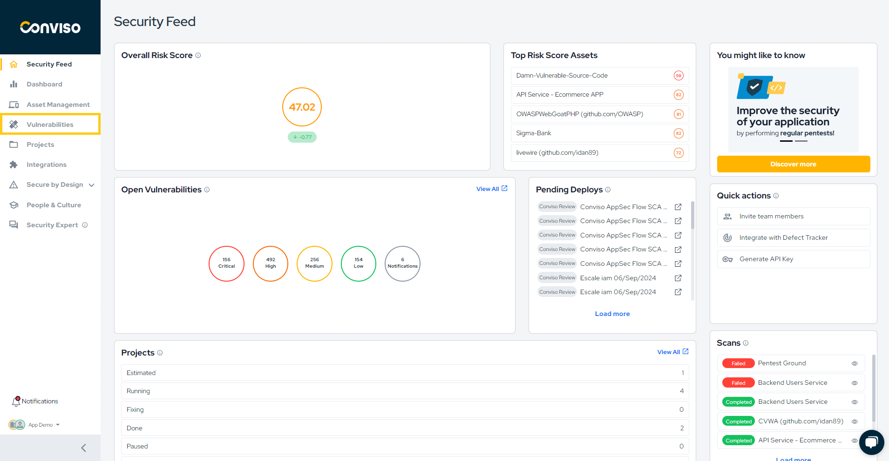
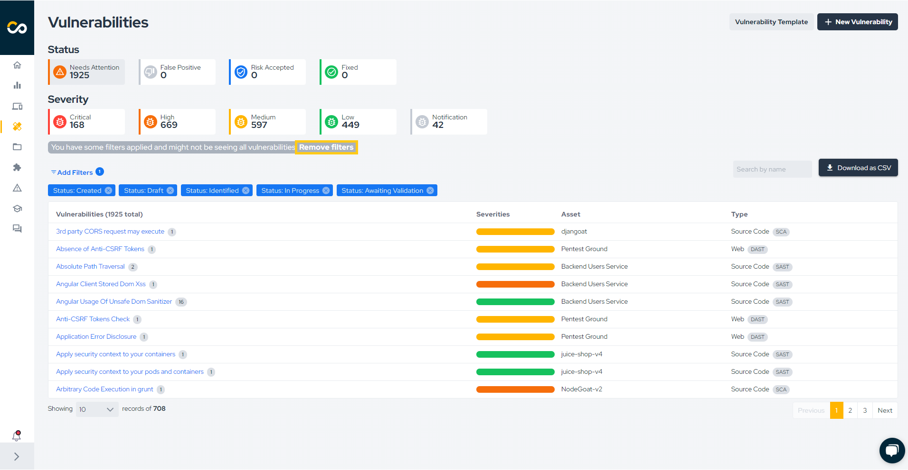
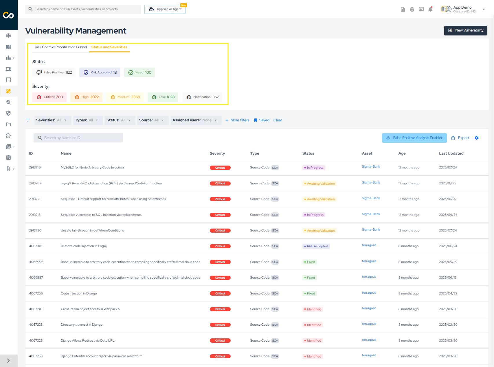
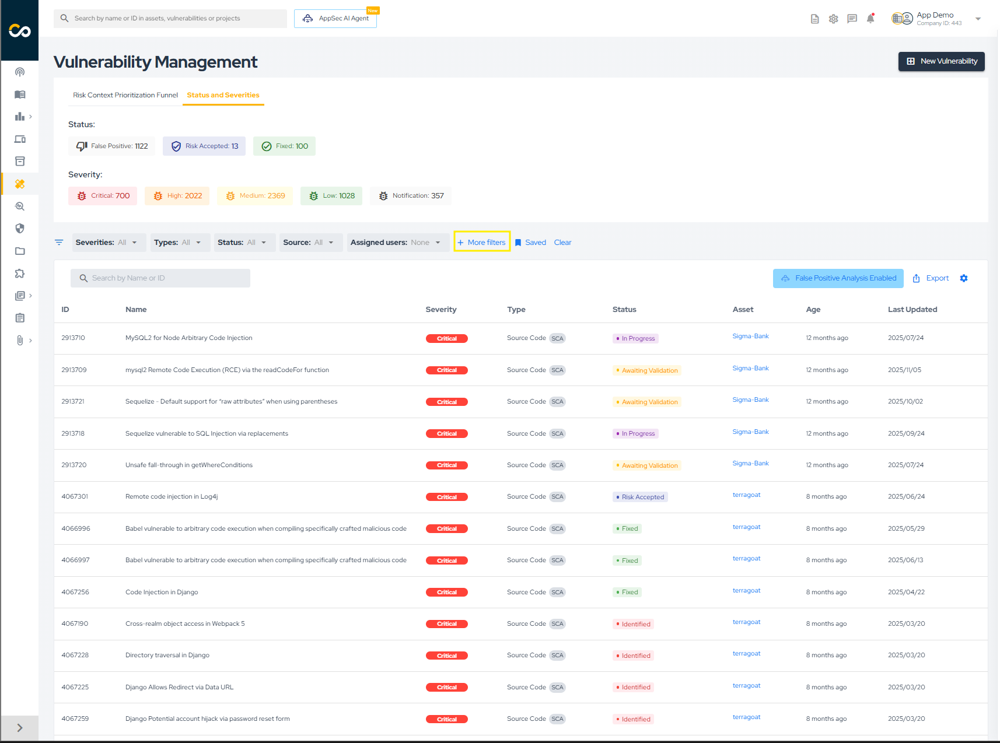
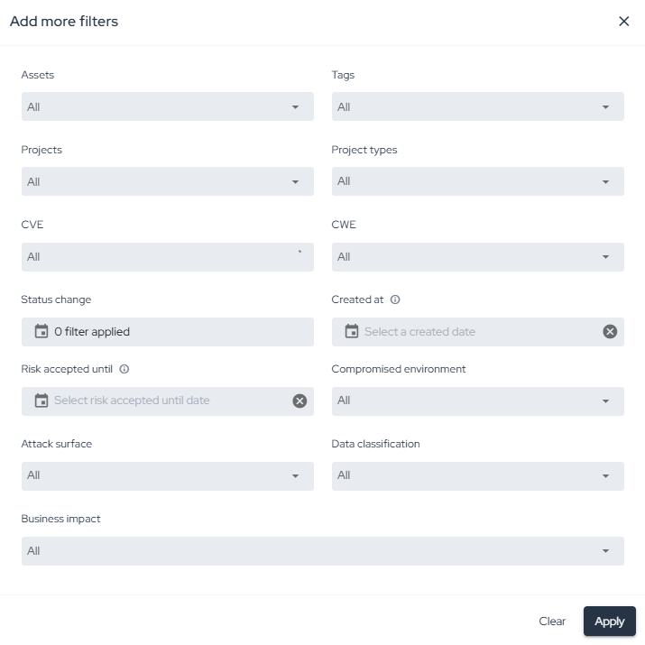
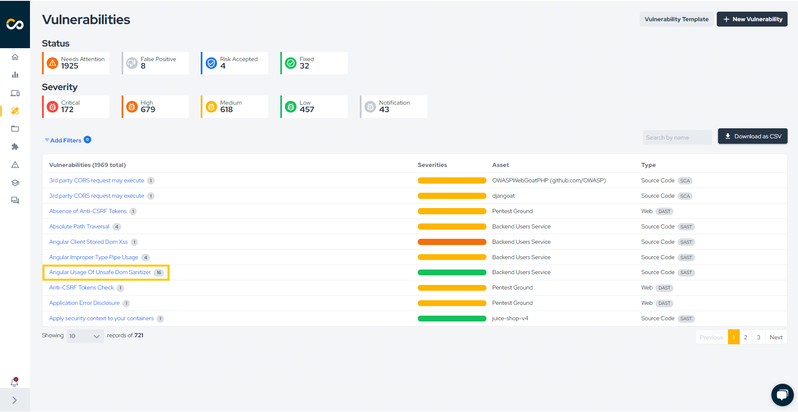
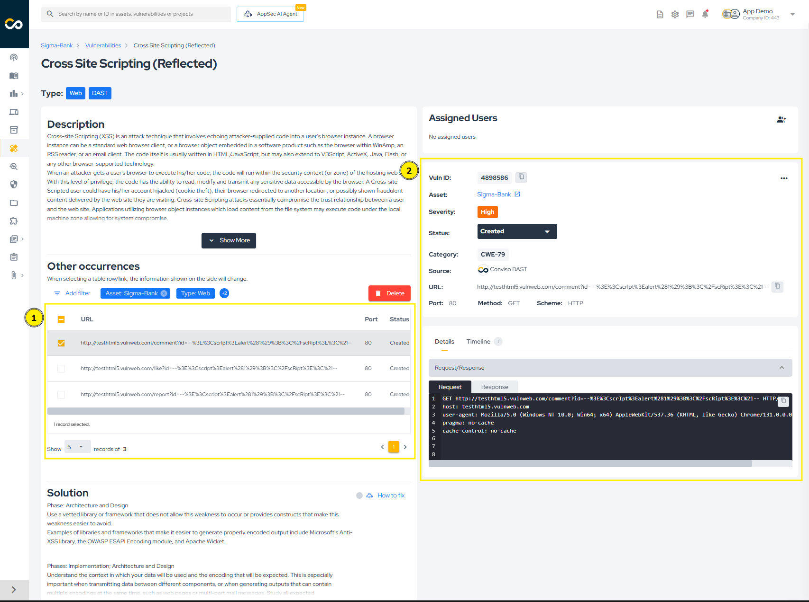
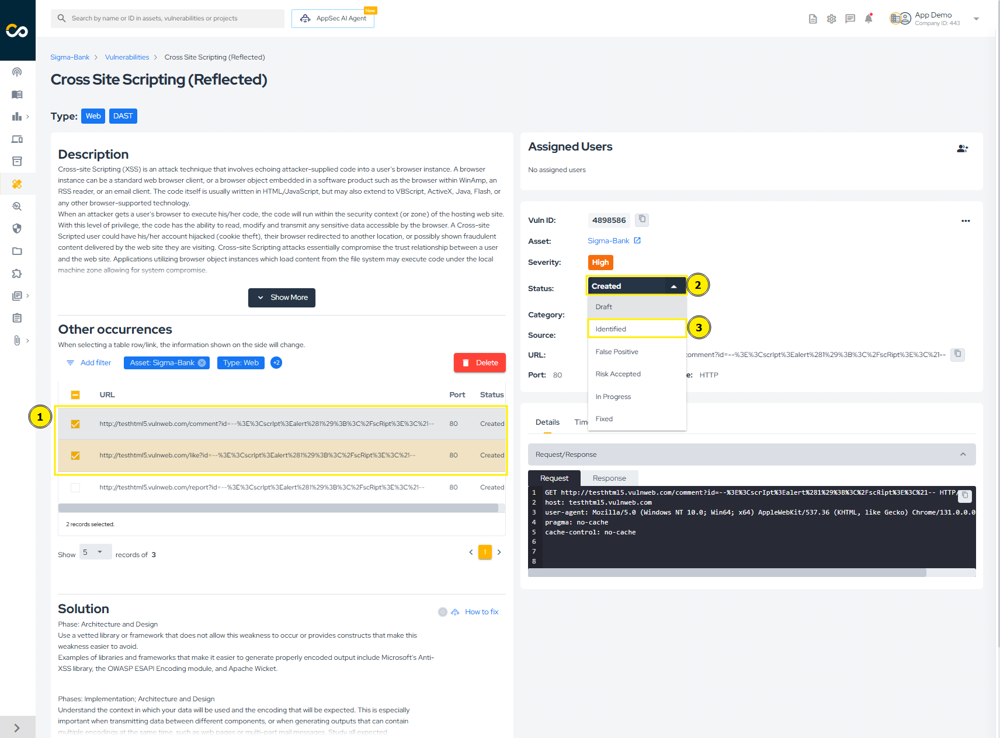
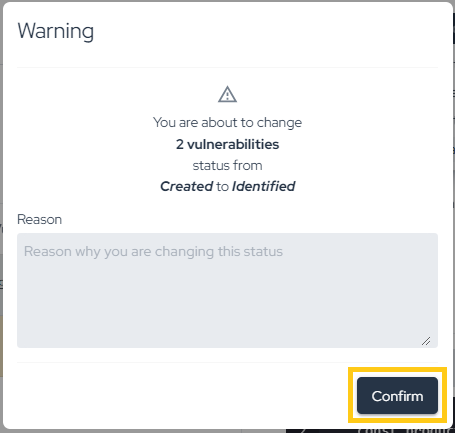
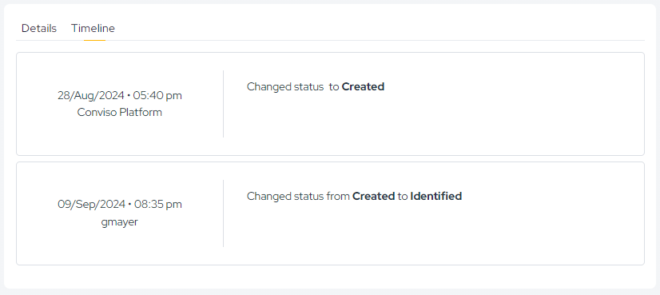

## Overview

The **Vulnerabilities** area is the central workspace for reviewing findings, investigating evidence, following remediation progress, and updating vulnerability statuses.

This process page covers how teams typically work in that view:

* access the vulnerability list;
* filter and organize findings;
* inspect grouped occurrences;
* update statuses;
* follow remediation and validation.

## Access the Vulnerability List

To access vulnerabilities:

1. In the left navigation menu, click **Vulnerabilities**.

2. The platform will display the vulnerability list for your company.
Once accessed, the vulnerability view becomes the central hub for analysis, remediation tracking, and validation.

:::note
Once selected, all open vulnerabilities will be listed, including those with the statuses "Created," "Draft," "Identified," "In Progress," and "Awaiting Validation."
:::

### Default Visibility

By default, the vulnerability list displays all open vulnerabilities, including the following statuses:

* Created
* Identified
* In Progress
* Awaiting Validation

Statuses such as Fixed, Risk Accepted, and False Positive may appear depending on the selected filters.

## Filter Vulnerabilities

**Clear Filters**
To view all vulnerabilities in your company, click **Clear** in the filters area.

**Quick Filters**

Quick filters allow rapid segmentation of vulnerabilities based on commonly used criteria such as severity, status, or source.

To apply specific filters, you have two options:

1. Choose from the quick filter options highlighted below:

2. Click "More filters" for a more detailed search:

**Advanced Filters**

Click More filters to apply detailed criteria, including:

* Asset
* Vulnerability type
* Source (SAST, DAST, SCA, Container, etc.)
* Status
* Severity
* Date ranges

All exports and views reflect the filters applied at the moment of action.

## Review Vulnerability Details

In the vulnerability list, issues are grouped by title, asset, and type. This makes it easier to review different occurrences of the same vulnerability in a single asset.

1. Click on the vulnerability title:

2. The left column displays information shared by all occurrences of that vulnerability, such as title, type, description, solution, and references.

3. The occurrences table shows each instance found in the asset. You can select one or more rows for review or bulk actions.

4. The right-hand column displays details for the selected occurrence, including ID, severity, status, source, vulnerable file and lines, code snippet, timeline, and attachments.

## Update Vulnerability Status

To update the status of a vulnerability, check how many lines are selected in the "Occurrences" table. In the image below, **two vulnerabilities are selected (1)**. Then, **click on the current status of the vulnerability (2)** and **select the new status (3)**:

A warning will appear to confirm the status change. Simply click "Confirm" to proceed:

If more than one vulnerability is selected, the change will be processed in the background, which may take a few moments to complete (don't worry — if there is an error, you will be notified via email). If only one vulnerability is selected, the change will be immediate. You can see the time of all status changes by viewing the "Timeline," as shown below:

All changes are recorded in the Timeline, ensuring full auditability.

## Follow Remediation

The remediation flow depends on the vulnerability source. For example:

1. External Scanners (Checkmarx, Dependency Track, Fortify, SonarCloud, SonarQube): The vulnerability must be recognized as fixed by the scanner. On the next synchronization, the status will change to "Fixed" on the platform;
2. DAST Vulnerabilities: After remediation, a new scan must be performed. If the vulnerability is no longer found, its status will automatically change to "Fixed" on the platform;
3. Conviso AST Vulnerabilities: After remediation, if the flag --vulnerability-auto-close is used, the fix will be detected and the vulnerability status will change automatically to "Fixed";
4. Manually Created Vulnerabilities: For manually created vulnerabilities (e.g., from Code Review or Pentest), the status change is not automatic. These must be manually updated to "Fixed" on the platform after being remediated.
